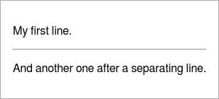
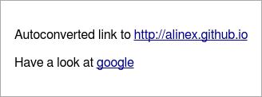

Package: alinex-report
=================================================

[](https://travis-ci.org/alinex/node-report)
[](https://coveralls.io/r/alinex/node-report?branch=master)
[](https://gemnasium.com/alinex/node-report)

This report module should help you create complex reports in an easy
way. You create a new object and append different text objects step by step. At last
you may access the markdown text or get it converted to HTML.

The key features are:

- easy markdown writing
- feature rich markdown
- export as text, console, html (also optimized for email), pdf, png or jpg
- convert text to visual representation like qr, chart or UML
- optimized interactive tables

See example output within the different element descriptions below.

Internally this works with a markdown syntax which has a limited number of possibilities
but is easy to transform in nearly any other format. If you know markdown you will
find the possibilities here enormous. And you may also directly load markdown and
process it using this package.

The html export can also be optimized for email using `ìnlineCss` option. With
this the styles from the head section will moved into the document because
webmail client will remove the head section completely. Only for javascript there
is no possible replacement.

> It is one of the modules of the [Alinex Universe](http://alinex.github.io/code.html)
> following the code standards defined in the [General Docs](http://alinex.github.io/develop).


Install
-------------------------------------------------

[
 
](https://www.npmjs.com/package/alinex-database)

The easiest way is to let npm add the module directly to your modules
(from within you node modules directory):

``` sh
npm install alinex-report --save
```

And update it to the latest version later:

``` sh
npm update alinex-report --save
```

This package will install a lot of subpackages to ensure the full functionality
but only the ones really needed are loaded on demand.

Always have a look at the latest [changes](Changelog.md).


Usage
-------------------------------------------------

The first step is to load the module and setup it:

``` coffee
Report = require 'alinex-report'
Report.setup ->
  # go on
```

And now you create a new object:

``` coffee
report = new Report()
```

You may also give some of the following options:

- `source` - markdown text to preload
- `log` - a function called each time something is added with the added text
- `width` - the width for line breaks (default: 80)

### Report builder

The report builder is a collection of methods used to easily create the needed
markup. They often are handy to convert your objects into formatted text:

``` coffee
report.h1 "My Test"
report.p "This is a short demonstrative test with:"
report.list [
  "headings"
  "text blocks"
  "unnumbered lists"
]
```

### Format output

And finally get the complete result:

``` coffee
console.log report # same as report.toString()
text = report.toString() # markdown syntax
html = report.toHtml()   # html
log = report.toConsole() # text with ansi colors
```

### Convert to Markdown

Instead of creating a report to collect everything, you can also let this module
convert single elements on the fly:

``` coffee
console.log Report.ul ['one', 'two', 'three']
console.log Report.p "This text contains a #{Result.b 'bold'} word."
```

### Markdown as Base

If you want to only convert existing markdown into html do this like:

``` coffee
html = new Report({source: markdownText}).toHtml()
```

### Mask characters

To mask some characters to be not interpreted as markdown, you may use `\` before
the special markdown signs or automatically mask them using `Report.mask text`
if you didn't want to interpret them as markdown.


Report Elements
-------------------------------------------------
The report builder is a collection of methods used to easily create the needed
markup. They often are handy to convert your objects into formatted text. In
contrast you may define the markup by yourself (see below) and use the `raw()`
method to add it.

Often the text output will look like the markdown and the console output sometimes, too.

Settings to be done before using the reporter:

``` coffee
# globally
Report.width = 80
# only for instance
report = new Report()
report.width = 80
```

This setting will define the maximum line length (default is 80 characters). All
methods which use it have the ability to overwrite this default setting with an
individual number.

You may also set the width on the instance instead of globally giving it as a
parameter to the constructor. See the usage above.

### Heading

Use the methods h1 to h6 to create headings in the given level:

``` coffee
report = new Report()
report.h1 'My Title'
report.h2 'Subheading with specific width', 120
```

In the headings level 1 and 2 it is possible to give a width for the line length
as shown above.

``` markdown
h1 Heading
==========================================================================

h2 Heading
--------------------------------------------------------------------------

### h3 Heading

#### h4 Heading

##### h5 Heading

###### h6 Heading
```

With the default style this should look like:

 

Alternatively the first two levels may also defined as:

``` markdown
# h1 Heading

## h2 Heading
```

### Blocks

This allows the following types:

- p - add a text paragraph
- quote - add quoted text multiple level depth (second parameter)
- code - add a code block (language as additional parameter)

#### Normal

Use it for a normal text paragraph.

``` coffee
report.p 'A new paragraph.'
report.p 'A long text may be automatically broken into multiple lines.', 40
report.p 'And here comes a fixed\n linebreak.\n\nWith a second paragraph.'
```

You may give the line length for markdown as optional second parameter.

This goes into html as:

``` markdown
A new paragraph.

A long text may be automatically broken
into multiple lines.

And here comes a fixed\
linebreak.

With a second paragraph.
```

In markdown you write your text directly, line breaks will not be held but made
like needed. An empty line starts a new paragraph but if you need a line break
on a specific position use a slash at the end.

And renders in HTML as:


#### Quote

Quoted text is used if you show another opinion and it may also be multiple level
deep. It is like used in emails.


``` coffee
report.quote 'My home is my castle!'
report.quote "I would like to visit a castle in north scotland, next year.", 2, 40
```

Parameters:

- (string) text for thee quote
- (integer) depth level 1.. (default: 1)
- (integer) max width in markdown

You may give the quoting depth as second parameter and maybe the line length for
markdown as third parameter.

``` markdown
> My home is my castle!

> > I would like to visit a castle in
> > north scotland, next year.
```

An alternative format is:

``` markdown
> Blockquotes can also be nested...
>> ...by using additional greater-than signs right next to each other...
> > > ...or with spaces between arrows.
```

And renders as HTML:

 

#### Preformatted Text

This is used for any text which you didn't have a specific language but should alsobe displayed as a preformatted block.

``` coffee
report.code 'This is a text code block.\nIt should be kept as is.'
```

In the markdown this is represented with a block of at leasr three back quotes:

```` markdown
    This is a text code block.
    It should be kept as is.
````

And renders as HTML:


#### Code Highlighting

To display some code you can create a paragraph with syntax highlighting (only HTML)
in languages like:

- code like: bash, coffee, js, sh, sql
- data like: json, yaml
- documents like: handlebars, markdown

See [highlight.js](https://highlightjs.org/static/demo/) for all possible languages
to use.

``` coffee
report.code 'var x = Math.round(f);', 'js'
report.code 'This **is** a ==markdown== text', 'markdown'
report.code 'simple:\n  list: [a, b, 5]', 'yaml'
```

In the markdown this is represented with a block of at leasr three back quotes
followed by the language to use:

```` markdown
``` js
var x = Math.round(f);
```

``` markdown
This **is** a ==markdown== text
```

``` yaml
simple:
  list: ["a", b, 5]
```
````

And renders as HTML:


### Separation

A horizontal line may be used as seperation between text blocks.


``` coffee
report.p "My first line."
report.hr()
report.p "And another one after a separating line."
```

In the markdown this will be displayed with at least three dashes as a line:

``` markdown
My first line.

---

And another one after a separating line.
```

Alternatively you may use at least 3 or more undescores `___` or asterisk `***`
characters as a line.

And renders as HTML:

 

### Box

The following code makes a colored box around a markup text which may contain
any other markup. As second parameter the type of the box needs to be given
which is one of: 'detail', 'info', 'warning', 'alert'

``` coffee
report.box "Some more details here...", 'detail'
report.box "A short note.", 'info'
report.box "This is important!", 'warning'
report.box "Something went wrong!", 'alert'
```

An additional width parameter may also be given to set the display width in markdown.

In the markdown this is defined using driple colons as start and end with the
box type behind the start mark:

``` markdown
::: detail
Some more details here...
:::

::: info
A short note.
:::

::: warning
This is important!
:::

::: alert
Something went wrong!
:::
```

And renders as HTML or console output:

 

### Lists

Three types of lists are supported:

- ul - unordered list from array
- ol - ordered list from array
- dl - definition list from object

All this lists allow for alphanumeric sorting. Give `true` as second parameter or
`false` for reverse sorting but keep in mind that this is only working correctly
in straight lists (not sublists).
Also an additional width parameter for the markdown display width may be given as
third paramter.

#### Unordered List

This will create a list with bullets.

``` coffee
report.ul [
  'one'
  'two'
  "and this is a long text because i can't only write numbers
  down here to show the proper use of the lists also with long text lines" 'last\ntwo lines'
report.hr()
report.ul [
  'one'
  'two'
  ['subline', 'and more']
  'three'
]
```

In the markdown the same list is defined as:

``` markdown
- one
- two
- and this is a long text because i can't only write numbers down here to show
  the proper use of the lists also with long text lines
- last\
  two lines

---

- one
- two
  - and more
  - subline
- three
```

Alternatively `*`, `+` or `-` may also be used as list symbols, also in mixed
format.

``` markdown
+ Create a list by starting a line with `+`, `-`, or `*`
+ Sub-lists are made by indenting 2 spaces:
  - Marker character change forces new list start:
    * Ac tristique libero volutpat at
    + Facilisis in pretium nisl aliquet
    - Nulla volutpat aliquam velit
+ Very easy!
```

And renders as HTML:

 

#### Ordered List

This will create a numbered list.

``` coffee
report.ol [
  'one'
  'two'
  "and this is a long text because i can't only write numbers
  down here to show the proper use of the lists also with long text lines" 'last\ntwo lines'
report.hr()
report.ol [
  'one'
  'two'
  ['subline', 'and more']
  'three'
]
```

In the markdown the same list is defined as:

``` markdown
1. one
2. two
3. and this is a long text because i can't only write numbers down here to show
   the proper use of the lists also with long text lines
4. last\
   two lines

---

1. one
2. two
   1. and more
   2. subline
3. three
```

It doesn't matter if you give the same number multiple times, only the first number's
value is used to start numbering. To start at a specific number start with it:

``` markdown
1. You can use sequential numbers...
1. ...or keep all the numbers as `1.`

Start numbering with offset:

57. foo
1. bar
```

And renders as HTML:

 

#### Definition List

This will display some phrases as list entries with their contents.

``` coffee
report.dl
  html: 'Markup language for internet pages'
  css: 'Style language to bring the layout into html'
, true
```

Like seen in the example the sorting may be set to true.

In the markdown the same list is defined as:

``` markdown
css

: Style language to bring the layout into html

html

: Markup language for internet pages
```

In the markdown you may also use:

``` markdown
Term 1

:   Definition 1
with lazy continuation.

Term 2 with *inline markup*

:   Definition 2

    Second paragraph of definition 2.

Compact style:

Term 1
  ~ Definition 1

Term 2
  ~ Definition 2a
  ~ Definition 2b
```

And renders as HTML:

 

#### Check Lists

A check list in which each row maybe done or not.

``` coffee
report.check
  'todo list': true
  'with elements done': true
  'and something todo': false
```

The values in the given map defines if they are done or not.

As markdown this is written as:

``` markdown
[x] todo list
[x] with elements done
[ ] and something todo
```

And renders as HTML and console output:

 

### Inline Formats

These are only available on static calls not on a report instance! But you may add
them into another instance method.

- b - bold like `__bold__`
- i - italic like `_italic_`
- del - delete like `~~delete~~`
- sub - subscript like `~subscript~`
- sup - superscript like `^superscript^`
- tt - typewriter like \`typewriter\`
- mark - marked text like highlighted with an text marker like `==marked==`

``` coffee
report.p "This should show as #{Report.b "bold"} format."
report.p "This should show as #{Report.i "italic"} format."
report.p "This should show as #{Report.del "strikethrough"} format."
report.p "This should show as #{Report.tt "typewriter"} format."
report.p "This should show as #{Report.sub "subscript"} format."
report.p "This should show as #{Report.sup "superscript"} format."
report.p "This should show as #{Report.mark "highlight"} format."
```

You may also combine this calls feeding one result into the other method:

``` coffee
report.p "Water has the formula " + Report.b("H#{Report.sub 2}O") + " *v* ."
```

The markdown will look like:

``` markdown
This should show as __bold__ format.

This should show as _italic_ format.

This should show as ~~strikethrough~~ format.

This should show as `typewriter` format.

This should show as ~subscript~ format.

This should show as ^superscript^ format.

This should show as ==highlight== format.
```

As an alternative syntax you may use `*italic*` or `**bold**` for this formats, too.

The complex example from above will look like:

``` markdown
Water has the formula __H~2~O__.
```

And renders as HTML:

 

And also in console some formats are interpreted:


### Links

If you add a link you can give the full url in the text or add the link  as an
inline element with:

- link text
- url
- title text shown as tooltip in html (optional)

``` coffee
report.p "Autoconverted link to http://alinex.github.io"
link = Report.a 'google', 'http://google.com', 'Open Google Search'
report.p "Have a look at #{link}"
```

As markdown the link text goes into square brackets, the url in brackets with the optional title text in quotes within:

``` markdown
Autoconverted link to http://alinex.github.io

Have a look at [google](http://google.com "Open Google Search")
```

And renders as HTML:



Console and text output will be the same as markdown.

### Images

Images may be added nearly the same way as links. The parameters are:

- alternative text
- url
- title text shown as tooltip in html (optional)

``` coffee
report.p Report.img 'Alinex', 'https://alinex.github.io/images/Alinex-200.png'
report.p Report.img 'Alinex Black', 'https://alinex.github.io/images/Alinex-black-200.png', "The Alinex Logo"
image = Report.img 'Alinex', 'https://alinex.github.io/images/Alinex-200.png'
report.p "With link: " + Report.a image, 'http://alinex.github.com'
```

The markdown also looks the same as for links with an exclamation mark before:

``` markdown


With link:
[](http://alinex.github.com)
```

With a link the image goes into the square brackets of the link text.

And renders as HTML and console output:

 

The text conversion is the same as conspole output.

### Special Signs

You may also include some special signs.

#### Typographic

``` coffee
report.h3 "classic typographs: "
report.ul [
  "copyright:   (c) (C)"
  "registeres:  (r) (R) "
  "trademark:   (tm) (TM) "
  "paragraph:   (p) (P) "
  "math:        +-"
]
```

``` markdown
### classic typographs

- copyright:   (c) (C)
- registeres:  (r) (R)
- trademark:   (tm) (TM)
- paragraph:   (p) (P)
- math:        +-
```

And renders as HTML and console output:

 

#### Emoji

``` coffee
report.h3 "emoji:"
report.ul [
  """angry:            :angry:            >:(     >:-("""
  """blush:            :blush:            :")     :-")"""
  """broken_heart:     :broken_heart:     </3     <\\3"""
  """confused:         :confused:         :/      :-/"""
  """cry:              :cry:              :,(   :,-("""
  """frowning:         :frowning:         :(      :-("""
  """heart:            :heart:            <3"""
  """imp:              :imp:              ]:(     ]:-("""
  """innocent:         :innocent:         o:)     O:)     o:-)      O:-)      0:)     0:-)"""
  """joy:              :joy:              :,)      :,-)   :,D      :,-D"""
  """kissing:          :kissing:          :*      :-*"""
  """laughing:         :laughing:         x-)     X-)"""
  """neutral_face:     :neutral_face:     :|      :-|"""
  """open_mouth:       :open_mouth:       :o      :-o     :O      :-O"""
  """rage:             :rage:             :@      :-@"""
  """smile:            :smile:            :D      :-D"""
  """smiley:           :smiley:           :)      :-)"""
  """smiling_imp:      :smiling_imp:      ]:)     ]:-)"""
  """sob:              :sob:              ;(     ;-("""
  """stuck_out_tongue: :stuck_out_tongue: :P      :-P"""
  """sunglasses:       :sunglasses:       8-)     B-)"""
  """sweat:            :sweat:            ,:(     ,:-("""
  """sweat_smile:      :sweat_smile:      ,:)     ,:-)"""
  """unamused:         :unamused:         :s      :-S     :z      :-Z     :$      :-$"""
  """wink:             :wink:             ;)      ;-)"""
]
```

``` markdown
### emoji:

- angry:            :angry:            >:(     >:-(
- blush:            :blush:            :")     :-")
- broken_heart:     :broken_heart:     </3     <\3
- confused:         :confused:         :/      :-/
- cry:              :cry:              :,(   :,-(
- frowning:         :frowning:         :(      :-(
- heart:            :heart:            <3
- imp:              :imp:              ]:(     ]:-(
- innocent:         :innocent:         o:)     O:)     o:-)      O:-)      0:)
     0:-)
- joy:              :joy:              :,)      :,-)   :,D      :,-D
- kissing:          :kissing:          :*      :-*
- laughing:         :laughing:         x-)     X-)
- neutral_face:     :neutral_face:     :|      :-|
- open_mouth:       :open_mouth:       :o      :-o     :O      :-O
- rage:             :rage:             :@      :-@
- smile:            :smile:            :D      :-D
- smiley:           :smiley:           :)      :-)
- smiling_imp:      :smiling_imp:      ]:)     ]:-)
- sob:              :sob:              ;(     ;-(
- stuck_out_tongue: :stuck_out_tongue: :P      :-P
- sunglasses:       :sunglasses:       8-)     B-)
- sweat:            :sweat:            ,:(     ,:-(
- sweat_smile:      :sweat_smile:      ,:)     ,:-)
- unamused:         :unamused:         :s      :-S     :z      :-Z     :$     
  :-$
- wink:             :wink:             ;)      ;-)
```

And renders as HTML:


Text and console output are the same as the markdown.

#### Font Awesome

Font Awesome gives you scalable vector icons that can instantly be customized — size,
color, drop shadow, and anything that can be done with the power of CSS.
You can use all the icons from [FontAwesome](http://fontawesome.io/icons/) to add
to your markup (html only):

``` coffee
report.h3 "fontawesome:"
report.p "basic icons:   :fa-flag:    :fa-camera-retro:"
report.p "larger icons:  :fa-camera-retro fa-lg: :fa-camera-retro fa-2x: :fa-camera-retro fa-3x:"
report.p "fixed width:   :fa-home fa-fw:   :fa-pencil fa-fw:"
report.ul [
  "<!-- {ul:.fa-ul}-->"
  "list symbols:  :fa-li fa-check-square:"
]
report.p ":fa-quote-left fa-3x fa-pull-left fa-border:
  ...tomorrow we will run faster, stretch out our arms farther...
  And then one fine morning— So we beat on, boats against the
  current, borne back ceaselessly into the past."
report.p "animated icons:    :fa-spinner fa-spin fa-2x fa-fw:
  :fa-circle-o-notch fa-spin fa-2x fa-fw:
  :fa-refresh fa-spin fa-2x fa-fw:
  :fa-cog fa-spin fa-2x fa-fw:
  :fa-spinner fa-pulse fa-2x fa-fw:"
report.p "flipped and rotated:   :fa-shield: normal
  :fa-shield fa-rotate-90: fa-rotate-90
  :fa-shield fa-rotate-180: fa-rotate-180
  :fa-shield fa-rotate-270: fa-rotate-270
  :fa-shield fa-flip-horizontal: fa-flip-horizontal
  :fa-shield fa-flip-vertical: fa-flip-vertical"
report.p "stacked icons:
  :fa-stack fa-lg fa-stack-2x fa-square-o fa-stack-1x fa-twitter:
  :fa-stack fa-lg fa-stack-2x fa-circle fa-stack-1x fa-flag fa-inverse:
  :fa-stack fa-lg fa-stack-2x fa-square fa-stack-1x fa-terminal fa-inverse:
  :fa-stack fa-lg fa-stack-1x fa-camera fa-stack-2x fa-ban text-danger:"
```

- __Basic Icons__

  You can place Font Awesome icons just about anywhere as inline text using the icon's
  name. The icon size and color will match the surrounding text paragraph.

  - __Colors__

  Use the classes `text-red`, `text-green`, `text-yellow`, `text-blue`, `text-magenta`, `text-cyan`
  or `text-gray` to change the colors.

- __Larger Icons__

  To increase icon sizes relative to their container, use the `fa-lg` (33% increase),
  `fa-2x`, `fa-3x`, `fa-4x`, or `fa-5x` classes.

- __Fixed Width__

  Use `fa-fw` to set icons at a fixed width. Great to use when different icon widths
  throw off alignment. Especially useful in things like lists.

- __List Icons__

  Use `fa-ul` and `fa-li` to easily replace default bullets in unordered lists.

- __Bordered Icons__

  Use `fa-border` and `fa-pull-right` or `fa-pull-left` for easy pull quotes or article icons.

- __Animated Icons__

  Use the `fa-spin` class to get any icon to rotate, and use `fa-pulse` to have it rotate
  with 8 steps. Works well with `fa-spinner`, `fa-refresh` and `fa-cog`.

- __Flipped and Rotated__

  To arbitrarily rotate and flip icons, use the `fa-rotate-*` and `fa-flip-*` classes.

- __Stacked Icons__

  To stack multiple icons, use the `fa-stack-1x` as start for the regularly sized icon, and
  `fa-stack-2x` for the larger icon and the icon itself with it's manipulations like `fa-inverse`
  behind.

``` markdown
### fontawesome:

__basic icons:__   :fa-flag:    :fa-camera-retro:

__larger icons:__  :fa-camera-retro fa-lg: :fa-camera-retro fa-2x:
:fa-camera-retro fa-3x:

__fixed width:__   :fa-home fa-fw:   :fa-pencil fa-fw:

- <!-- {ul:.fa-ul}-->
- __list symbols:__  :fa-li fa-check-square:

:fa-quote-left fa-3x fa-pull-left fa-border: __border icons:__ ...tomorrow we
will run faster, stretch out our arms farther... And then one fine morning— So
we beat on, boats against the current, borne back ceaselessly into the past.

__animated icons:__    :fa-spinner fa-spin fa-2x fa-fw: :fa-circle-o-notch
fa-spin fa-2x fa-fw: :fa-refresh fa-spin fa-2x fa-fw: :fa-cog fa-spin fa-2x
fa-fw: :fa-spinner fa-pulse fa-2x fa-fw:

__flipped and rotated:__   :fa-shield: normal :fa-shield fa-rotate-90:
fa-rotate-90 :fa-shield fa-rotate-180: fa-rotate-180 :fa-shield fa-rotate-270:
fa-rotate-270 :fa-shield fa-flip-horizontal: fa-flip-horizontal :fa-shield
fa-flip-vertical: fa-flip-vertical

__stacked icons:__ :fa-lg fa-stack-2x fa-square-o fa-stack-1x fa-twitter: :fa-lg
fa-stack-2x fa-circle fa-stack-1x fa-flag fa-inverse: :fa-lg fa-stack-2x
fa-square fa-stack-1x fa-terminal fa-inverse: :fa-lg fa-stack-1x fa-camera
fa-stack-2x fa-ban text-red:
```

And renders as HTML and console output:

 

In text and console output only the icons are kept in a compressed format. All modulations
are removed.

### Table

Output a table (data object and optional column object needed). This can be called
with different kind of objects making it easy to use nearly everything you have.

    Syntax: report.table <object>, <columns>, <sort>, <mask>

The complexest format will be shown at first:

    <object>  : a list of row maps like returned from a database
    <columns> : a map of column id to use as columns with the options:
                - title - heading text
                - align - orientation (one of 'left', 'center', 'right')
                - width - the minimum width of the column (optional)
    <sort>    : a map of sort conditions defining the column id and order ('asc', 'desc')
    <mask>    : (boolean) use Report.mask() on each field value

All other formats will be converted into this filling missing information with
default values. You may also use the [table](http://alinex.github.io/node.table)
format which can include the column settings and often is already sorted.

There are lots of ways to use this.

#### from alinex-table

__Simple conversion__

``` coffee
table = new Table [
  ['ID', 'English', 'German']
  [1, 'one', 'eins']
  [2, 'two', 'zw_ei']
  [3, 'three', 'drei']
  [12, 'twelve', 'zwölf']
]

report = new Report()
report.table table
```

``` markdown
| ID | English | German |
|:-- |:------- |:------ |
| 1  | one     | eins   |
| 2  | two     | zw_ei  |
| 3  | three   | drei   |
| 12 | twelve  | zwölf  |
```

And renders as HTML and console output:

 

__With align settings__

``` coffee
table = new Table [
  ['ID', 'English', 'German']
  [1, 'one', 'eins']
  [2, 'two', 'zw_ei']
  [3, 'three', 'drei']
  [12, 'twelve', 'zwölf']
]
table.style null, 'ID', {align: 'right'}

report = new Report()
report.table table
```

``` markdown
| ID | English | German |
| --:|:------- |:------ |
|  1 | one     | eins   |
|  2 | two     | zw_ei  |
|  3 | three   | drei   |
| 12 | twelve  | zwölf  |
```

And renders as HTML and console output:

 

__With mask settings__

``` coffee
table = new Table [
  ['ID', 'English', 'German']
  [1, 'one', 'eins']
  [2, 'two', 'zw_ei']
  [3, 'three', 'drei']
  [12, 'twelve', 'zwölf']
]

report = new Report()
report.table table, null, null, true
```

``` markdown
| ID | English | German |
|:-- |:------- |:------ |
| 1  | one     | eins   |
| 2  | two     | zw\_ei |
| 3  | three   | drei   |
| 12 | twelve  | zwölf  |
```

And renders as HTML:


#### with list-map

``` coffee
table = [
  {id: 1, en: 'one', de: 'eins'}
  {id: 2, en: 'two', de: 'zwei'}
  {id: 3, en: 'three', de: 'drei'}
  {id: 12, en: 'twelve', de: 'zwölf'}
]

report = new Report()
report.table table
```

``` markdown
| id | en     | de    |
|:-- |:------ |:----- |
| 1  | one    | eins  |
| 2  | two    | zwei  |
| 3  | three  | drei  |
| 12 | twelve | zwölf |
```

And renders as HTML and console output:


__Using column map-map__

``` coffee
table = [
  {id: 1, en: 'one', de: 'eins'}
  {id: 2, en: 'two', de: 'zwei'}
  {id: 3, en: 'three', de: 'drei'}
  {id: 12, en: 'twelve', de: 'zwölf'}
]
columns =
  id:
    title: 'ID'
    align: 'right'
  de:
    title: 'German'
  en:
    title: 'English'

report = new Report()
report.table table, columns
```

``` markdown
| ID | German | English |
| --:|:------ |:------- |
|  1 | eins   | one     |
|  2 | zwei   | two     |
|  3 | drei   | three   |
| 12 | zwölf  | twelve  |
```

And renders as HTML and console output:

 

__Using column list-map__

``` coffee
table = [
  {id: 1, en: 'one', de: 'eins'}
  {id: 2, en: 'two', de: 'zwei'}
  {id: 3, en: 'three', de: 'drei'}
  {id: 12, en: 'twelve', de: 'zwölf'}
]
columns = [
  ['id', 'en']
  ['ID', 'English']
]

report = new Report()
report.table table, columns
```

``` markdown
| ID | English |
|:-- |:------- |
| 1  | one     |
| 2  | two     |
| 3  | three   |
| 12 | twelve  |
```

And renders as HTML:


__Using column list__

``` coffee
table = [
  {id: 1, en: 'one', de: 'eins'}
  {id: 2, en: 'two', de: 'zwei'}
  {id: 3, en: 'three', de: 'drei'}
  {id: 12, en: 'twelve', de: 'zwölf'}
]
columns = ['ID', 'English', 'German']

report = new Report()
report.table table, columns
```

``` markdown
| ID | English | German |
|:-- |:------- |:------ |
| 1  | one     | eins   |
| 2  | two     | zwei   |
| 3  | three   | drei   |
| 12 | twelve  | zwölf  |
```

And renders as HTML:


__Using column map__

``` coffee
table = [
  {id: 1, en: 'one', de: 'eins'}
  {id: 2, en: 'two', de: 'zwei'}
  {id: 3, en: 'three', de: 'drei'}
  {id: 12, en: 'twelve', de: 'zwölf'}
]
columns =
  id: 'ID'
  en: 'English'

report = new Report()
report.table table, columns
```

``` markdown
| ID | English |
|:-- |:------- |
| 1  | one     |
| 2  | two     |
| 3  | three   |
| 12 | twelve  |
```

And renders as HTML:


__Using sort map__

``` coffee
table = [
  {id: 1, en: 'one', de: 'eins'}
  {id: 2, en: 'two', de: 'zwei'}
  {id: 3, en: 'three', de: 'drei'}
  {id: 12, en: 'twelve', de: 'zwölf'}
]
columns =
  id:
    title: 'ID'
    align: 'right'
  de:
    title: 'German'
  en:
    title: 'English'
sort = {de: 'desc'}

report = new Report()
report.table table, columns, sort
```

``` markdown
| ID | German | English |
| --:|:------ |:------- |
| 12 | zwölf  | twelve  |
|  2 | zwei   | two     |
|  1 | eins   | one     |
|  3 | drei   | three   |
```

And renders as HTML:


__Using sort list__

``` coffee
table = [
  {id: 1, en: 'one', de: 'eins'}
  {id: 2, en: 'two', de: 'zwei'}
  {id: 3, en: 'three', de: 'drei'}
  {id: 12, en: 'twelve', de: 'zwölf'}
]
columns =
  id:
    title: 'ID'
    align: 'right'
  de:
    title: 'German'
  en:
    title: 'English'
sort = ['de']

report = new Report()
report.table table, columns, sort
```

``` markdown
| ID | German | English |
| --:|:------ |:------- |
|  3 | drei   | three   |
|  1 | eins   | one     |
|  2 | zwei   | two     |
| 12 | zwölf  | twelve  |
```

And renders as HTM:


__Using sort key__

``` coffee
table = [
  {id: 1, en: 'one', de: 'eins'}
  {id: 2, en: 'two', de: 'zwei'}
  {id: 3, en: 'three', de: 'drei'}
  {id: 12, en: 'twelve', de: 'zwölf'}
]
columns =
  id:
    title: 'ID'
    align: 'right'
  de:
    title: 'German'
  en:
    title: 'English'
sort = 'de'

report = new Report()
report.table table, columns, sort
```

``` markdown
| ID | German | English |
| --:|:------ |:------- |
|  3 | drei   | three   |
|  1 | eins   | one     |
|  2 | zwei   | two     |
| 12 | zwölf  | twelve  |
```

And renders as HTML:


#### with list array

``` coffee
table = [
  [1, 'one', 'eins']
  [2, 'two', 'zwei']
  [3, 'three', 'drei']
  [12, 'twelve', 'zwölf']
]
report = new Report()
report.table table
```

``` markdown
| 1  | one    | eins  |
|:-- |:------ |:----- |
| 2  | two    | zwei  |
| 3  | three  | drei  |
| 12 | twelve | zwölf |
```

And renders as HTML:


__Using column list__

``` coffee
table = [
  [1, 'one', 'eins']
  [2, 'two', 'zwei']
  [3, 'three', 'drei']
  [12, 'twelve', 'zwölf']
]
columns = ['ID', 'English', 'German']

report = new Report()
report.table table, columns
```

``` markdown

| ID | English | German |
|:-- |:------- |:------ |
| 1  | one     | eins   |
| 2  | two     | zwei   |
| 3  | three   | drei   |
| 12 | twelve  | zwölf  |
```

And renders as HTML:


__Using column list-array__

``` coffee
table = [
  [1, 'one', 'eins']
  [2, 'two', 'zwei']
  [3, 'three', 'drei']
  [12, 'twelve', 'zwölf']
]
columns = [
  [0, 1]
  ['ID', 'English']
]

report = new Report()
report.table table, columns
```

``` markdown
| ID | English |
|:-- |:------- |
| 1  | one     |
| 2  | two     |
| 3  | three   |
| 12 | twelve  |
```

And renders as HTML:


__Using column list-map__

``` coffee
table = [
  [1, 'one', 'eins']
  [2, 'two', 'zwei']
  [3, 'three', 'drei']
  [12, 'twelve', 'zwölf']
]
columns = [
  title: 'ID'
  align: 'right'
,
  title: 'English'
,
  title: 'German'
]

report = new Report()
report.table table, columns
```

``` markdown
| ID | English | German |
| --:|:------- |:------ |
|  1 | one     | eins   |
|  2 | two     | zwei   |
|  3 | three   | drei   |
| 12 | twelve  | zwölf  |
```

And renders as HTML:


__With empty fields__

``` coffee
table = [
  [1, 'one', 'eins']
  [2, '', 'zwei']
  [3, null, 'drei']
  [12, undefined, 'zwölf']
]
report = new Report()
report.table table
```

``` markdown

| 1  | one | eins  |
|:-- |:--- |:----- |
| 2  |     | zwei  |
| 3  |     | drei  |
| 12 |     | zwölf |
```

And renders as HTML:


#### with map

``` coffee
table =
  id: '001'
  name: 'alex'
  position: 'developer'
report = new Report()
report.table table
```

``` markdown
| Name     | Value     |
|:-------- |:--------- |
| id       | 001       |
| name     | alex      |
| position | developer |
```

And renders as HTML:


__Using volumn list__

``` coffee
table =
  id: '001'
  name: 'alex'
  position: 'developer'
report = new Report()
report.table table
```

``` markdown
| NAME     | VALUE     |
|:-------- |:--------- |
| id       | 001       |
| name     | alex      |
| position | developer |
```

And renders as HTML:


__With list and object content__

``` coffee
table =
  number: [1..8]
  name: 'alex'
  data:
    type: 'developer'
    lang: 'javascript'
report = new Report()
report.table table
```

``` markdown
| Name      | Value                  |
|:--------- |:---------------------- |
| number    | 1, 2, 3, 4, 5, 6, 7, 8 |
| name      | alex                   |
| data.type | developer              |
| data.lang | javascript             |
```

And renders as HTML:


#### Interactive Table

Instead of simple tables for the HTML output they may be made interactive, allowing:

- sorting
- filtering
- paging

All these may be done by the user. But if such tables are outputted to other format
they will only show a normal table. It is also not possible to run this in most
mail clients (only if attached and opened in Browser).

``` coffee
report = new Report()
report.datatable new Table([
  ['ID', 'English', 'German']
  [1, 'one', 'eins']
  [2, 'two', 'zw_ei']
  [3, 'three', 'drei']
  [12, 'twelve', 'zwölf']
])
```

The possible options to give as second parameter are documented at the jQuery
[datatable](https://datatables.net/examples/styling/order-column.html). The default
will disable paging, search and info.

As markdown this will be written as three separate elements working together:

``` markdown
| ID | English | German |
|:-- |:------- |:------ |
| 1  | one     | eins   |
| 2  | two     | zw_ei  |
| 3  | three   | drei   |
| 12 | twelve  | zwölf  |
<!-- {table:#datatable1} -->
$$$ js
$(document).ready(function () {
  $('#datatable1').DataTable({
  "paging": false,
  "info": false
});
});
$$$
```

And finally in HTML this will look like (click to show working HTML):

[](http://htmlpreview.github.io/?https://github.com/alinex/node-report/blob/master/src/doc/datatable.html)

__Features__

In this example a lot of features are activated:

- info - (boolean) show information about the table including information about filtered
  data (default: false, true in markdown)
- paging - (boolean) set to true to enable paging of data (default: false, true in markdown)
- lengthChange - (boolean) control the end user's ability to change the paging display length of the table if paging is enabled (default: true)
- ordering - (boolean)  control ordering/sorting abilities in table (default: true)
- searching - (boolean) control search/filtering abilities (default: false, true in markdown)
- scrollX - (boolean) enable horizontal scrolling if necessary for viewport
- scrollY - (boolean) enable vertical scrolling if necessary for viewport

``` coffee
report = new Report()
report.datatable new Table([
  ['ID', 'English', 'German']
  [1, 'one', 'eins']
  [2, 'two', 'zwei']
  [3, 'three', 'drei']
  [4, 'four', 'vier']
  [5, 'five', 'fünf']
  [6, 'six', 'sechs']
  [7, 'seven', 'sieben']
  [8, 'eight', 'acht']
  [9, 'nine', 'neun']
  [10, 'ten', 'zehn']
  [11, 'eleven', 'elf']
  [12, 'twelve', 'zwölf']
]),
  info: true
  paging: true
  searching: true
```

As markdown this will be written as follows:

``` markdown
| ID | English | German |
|:-- |:------- |:------ |
| 1  | one     | eins   |
| 2  | two     | zwei   |
| 3  | three   | drei   |
| 4  | four    | vier   |
| 5  | five    | fünf   |
| 6  | six     | sechs  |
| 7  | seven   | sieben |
| 8  | eight   | acht   |
| 9  | nine    | neun   |
| 10 | ten     | zehn   |
| 11 | eleven  | elf    |
| 12 | twelve  | zwölf  |
<!-- {table:#datatable1} -->
$$$ js
$(document).ready(function () {
  $('#datatable1').DataTable({
  "info": true,
  "paging": true,
  "searching": true
});
});
$$$
```

And finally in HTML this will look like (click to show working HTML):

[](http://htmlpreview.github.io/?https://github.com/alinex/node-report/blob/master/src/doc/datatable-features.html)


### Document Elements

These elements willl add some functionality to the overall document.

#### Table of Contents

This will add a table of contents as quicklink list to the resulting html document.
It will be removed on text and console output.

``` coffee
report = new Report()
report.toc()
report.h1 'Table of Contents Test'
report.h2 'My text'
report.p 'Something I have to say...'
report.h2 'Other opinions'
report.h3 'My parents'
report.p "You don't want to know."
report.h3 "My friends"
report.p 'They always support me.'
```

This will list all headings starting at level 2 in the quicklink list. The first
level headings are meant as document heading and therefore won't be listed in the
table.

In the markdown, all you have to do is add a `@[toc]` line there it should be added:

``` markdown
@[toc]


Table of Contents Test
================================================================================


My text
--------------------------------------------------------------------------------

Something I have to say...


Other opinions
--------------------------------------------------------------------------------

### My parents

You don't want to know.

### My friends

They always support me.
```

And renders as HTML you will find it on the right side (in the default style):


#### Abbreviations

Add an abbreviation entry (before use in the text):

``` coffee
report = new Report()
report.abbr 'HTTP', 'Hyper Text Transfer Protocol'
report.p "The HTTP protocol is used for transferring web content. A secured
version of HTTP called HTTPS is also available."
```

``` markdown
The HTTP protocol is used for transferring web content. A secured version of
HTTP called HTTPS is also available.

*[HTTP]: Hyper Text Transfer Protocol
```

This will mark the words in the HTML text and add the definition as tooltip to it:


#### Footnotes

You may use footnotes within the document:


``` coffee
report = new Report()
cern = report.footnote "European Organization for Nuclear Research\n\nSee more info at http://home.cern"
me = report.footnote "Alexander Schilling", 'a'
other = report.footnote "My colleagues as the University of Tübingen", 'b'
report.p "The World Wide Web (WWW) is invented by CERN#{cern}. But I#{me} and
prometheus#{other} used it to make a medical learning environment out of it.
_Alex#{me}_"
```

Each time one of the footnotes added to the text only a reference (number or free defined)
is added and the contents of all footnotes are collected at the end of the document.

In the markdown the same reference (number or name) can be used multiple times to reference
the same footnote.

``` markdown
The World Wide Web (WWW) is invented by CERN[^1]. But I[^a] and prometheus[^b]
used it to make a medical learning environment out of it. _Alex[^a]_

[^1]: European Organization for Nuclear Research

      See more info at http://home.cern
[^a]: Alexander Schilling
[^b]: My colleagues as the University of Tübingen
```

And rendered as HTML links will be added in the text and backlinks from the footnotes.:


### HTML Setup

This are settings which only influence html output and the formats depending on it
(pdf, images).

#### Direct Style

You can also give some specific styles (only) for the HTML output. This may overwrite
all default settings:

``` coffee
report = new Report()
report.p "Make this centered (using class)..." + Report.style '.center'
report.p "Make this centered and red (using classes)..." + Report.style '.center.red'
report.p "Set an id and class..." + Report.style '#top .hide'
report.p "Set an specific attriubute" + Report.img('google', 'https://www.google.de/images/branding\
/googlelogo/2x/googlelogo_color_272x92dp.png') + Report.style 'width=20'
```

As seen above it may also be used as instance method, which will add it at the end
or as class method to insert also inline.

Annotations will apply itself to the deepest element preceding it. But you may
To make it apply to a different element, precede your annotations with the tag name
followed by a `:`.
To go back to previous parent with the same name, add '^n' after the tag name, where
'n' is how many levels deep to go back to.

The following classes may be used:

|  STYLE  | RESULT         |
|:-------:|:-------------- |
| .text-red | color: red |
| .text-green | color: green |
| .text-yellow | color: yellow |
| .text-blue | color: blue |
| .text-magenta | color: magenta |
| .text-cyan | color: cyan |
| .text-gray | color: gray |
| .bg-white | background-color: white |
| .center | text-align: center |
| .left | float: left |
| .right | float: right |
| .hide | display: none |
| .spacing | padding: 10px |

In the markdown it is notated within an html comment:

``` markdown
Set float\
left and id...<!-- {#left .left} -->

Make this centered (using class)...<!-- {.center} -->

Make this centered and red (using classes)...
<!-- {.center.text-red} -->

Set image width

<!-- {width=60} -->

> * [Continue](#continue)
<!-- {a:.text-green} -->
<!-- {li:.text-red} -->
<!-- {blockquote:.right} -->

line 1

line 2

line 3

line 4

line 5
<!-- {p^3:.text-green} -->
```

And rendered as HTML:


#### Style Sheets

This will add or overwrite the page style rules. You may also add other rules which
you later call using the above direct style calls:

``` coffee
report = new Report()
report.css "#box {padding: 3px; border: solid black 1px; background: #eee;}
strong {color: red;}"
report.p "This document uses **style sheets** to make look bold text be red and
let some look like **buttons** using direct style for setting."
report.style '#box'
```

You can put everything into the css rules which goes into cascading style sheets.

In the markdown this goes into an execution tag:

``` markdown
$$$ css
#box {padding: 3px; border: solid black 1px; background: #eee;} strong {color: red;}
$$$

This document uses **style sheets** to make look bold text be red and let some
look like **buttons** using direct style for setting.
<!-- {#box} -->
```

The example above will lokk like (rendered as HTML):


#### Javascript

Like styles you may also add javascript functions to the document.

``` coffee
report = new Report()
report.js "test = function() { alert('Hello World!')}"
report.p "Call the [demo](#) which is included into the page."
report.style 'onclick="test()"'
```

If you use jQuery it will be added to your document automatically.

In the markdown this goes into an execution tag:

``` markdown
$$$ js
test = function() { alert('Hello World!')}
$$$

Call the [demo](#) which is included into the page.
<!-- {onclick="test()"} -->
```

The example above will lokk like (click to get working HTML):

[](http://htmlpreview.github.io/?https://github.com/alinex/node-report/blob/master/src/doc/js.html)

#### Header

You may also add any tag to the HTML head section using:

``` coffee
report = new Report()
report.header '<script type="text/javascript" src="http://myserver.com/my-lib.js"></script>'
```

This will add the script tag to the head section of the resulting HTML.

### Visualization

This will only work in HTML format, else the definition is displayed.

#### QR Code

QR Codes are used to pack some information into a scanable 2D Object.

__Simple Code__

You only need to give the content like an URL:

``` coffee
report = new Report()
report.qr "http://alinex.de"
```

This will be written in markdown as:

``` markdown
$$$ qr
http://alinex.de
$$$
```

And finally in HTML and text or console output:

 

__QR Extended__

You may also define how to make the code image:

``` coffee
report = new Report()
report.qr
  content: 'http://alinex.github.io'
  padding: 1
  width: 500
  height: 500
  color: '#ff0000'
  background: '#ffffff'
  ecl: 'M'
```

``` markdown
$$$ qr
content: 'http://alinex.github.io'
padding: 1
width: 500
height: 500
color: '#ff0000'
background: '#ffffff'
ecl: M
$$$
```

And finally in HTML and text or console output:

 

#### Charts

A lot of charts are possible based on [jui-chart](http://chartplay.jui.io/).
You'll find all possible settings there or look at some of the examples below.

``` coffee
report = new Report()
report.chart null, [
  ['quarter', 'sales', 'profit']
  ["1Q", 50, 35]
  ["2Q", 20, 100]
  ["3Q", 10, 5]
  ["4Q", 30, 25]
]
```

This makes a simple bar chart with predefined settings for your data. But you may
also specify a lot of options and charts. The examples below shows the possible
settings, but you only need to give some of them.

``` markdown
$$$ chart
| quarter | sales | profit |
|:------- |:----- |:------ |
| 1Q      | 50    | 35     |
| 2Q      | 20    | 100    |
| 3Q      | 10    | 5      |
| 4Q      | 30    | 25     |
$$$
```

This will render in HTML as (click to show in browser):

[](http://htmlpreview.github.io/?https://github.com/alinex/node-report/blob/master/src/doc/chart.html)

__Bar Chart__

``` coffee
report = new Report()
report.chart
  width: 400
  height: 400
  axis:
    y:
      type: 'block'
      domain: 'quarter'
      line: 'true'
    x:
      type: 'range'
      domain: 'profit'
      line: 'rect' # dashed with gradient
  brush: [
    type: 'bar'
    size: 15
    target: ['sales', 'profit']
    innerPadding: 10
  ]
  widget: [
    type: 'title'
    text: 'Bar Chart'
  ,
    type: 'legend'
  ,
    type: 'tooltip'
  ]
, [
  ['quarter', 'sales', 'profit']
  ["2015/Q1", 50, 35]
  ["2015/Q2", 20, 100]
  ["2015/Q3", 10, 5]
  ["2015/Q4", 30, 25]
]
```

``` markdown

$$$ chart
width: 400
height: 400
axis:
  'y':
    type: block
    domain: quarter
    line: 'true'
  x:
    type: range
    domain: profit
    line: rect
brush:
  - type: bar
    size: 15
    target:
      - sales
      - profit
    innerPadding: 10
widget:
  - type: title
    text: Bar Chart
  - type: legend
  - type: tooltip

| quarter | sales | profit |
|:------- |:----- |:------ |
| 2015/Q1 | 50    | 35     |
| 2015/Q2 | 20    | 100    |
| 2015/Q3 | 10    | 5      |
| 2015/Q4 | 30    | 25     |
$$$
```

This will render in HTML as (click to show in browser):

[](http://htmlpreview.github.io/?https://github.com/alinex/node-report/blob/master/src/doc/chart-bar.html)

__3D Bar Chart__

``` coffee
report = new Report()
report.chart
  width: 400
  height: 400
  axis:
    x:
      type: 'range'
      domain: 'profit'
      step: 5
    y:
      type: 'block'
      domain: 'quarter'
    c:
      type: 'grid3d'
      domain: ['sales', 'profit']
    depth: 20
    degree: 30
  brush: [
    type: 'bar3d'
    outerPadding: 10
    innerPadding: 5
  ]
  widget: [
    type: 'title'
    text: '3D Bar Chart'
  ,
    type: 'tooltip'
  ,
    type: 'legend'
  ]
, [
  ['quarter', 'sales', 'profit']
  ["2015/Q1", 50, 35]
  ["2015/Q2", 20, 100]
  ["2015/Q3", 10, 5]
  ["2015/Q4", 30, 25]
]
```

The markdown will contain the settings and the data table like above.

This will render in HTML as (click to show in browser):

[](http://htmlpreview.github.io/?https://github.com/alinex/node-report/blob/master/src/doc/chart-bar-3d.html)

__Column Chart__

``` coffee
report = new Report()
report.chart
  width: 400
  height: 400
  axis:
    x:
      type: 'block'
      domain: 'quarter'
    y:
      type: 'range'
      domain: 'profit'
      step: 10
      line: true
  brush: [
    type: 'column'
    target: ['sales', 'profit']
  ,
    type: 'focus'
    start: 1
    end: 1
  ]
  widget: [
    type: 'title'
    text: 'Column Chart with Focus'
  ,
    type: 'tooltip'
  ,
    type: 'legend'
  ]
, [
  ['quarter', 'sales', 'profit']
  ["2015/Q1", 50, 35]
  ["2015/Q2", 20, 100]
  ["2015/Q3", 10, 5]
  ["2015/Q4", 30, 25]
]
```

The markdown will contain the settings and the data table like above.

This will render in HTML as (click to show in browser):

[](http://htmlpreview.github.io/?https://github.com/alinex/node-report/blob/master/src/doc/chart-column.html)

__3D Column Chart__

``` coffee
report = new Report()
report.chart
  width: 400
  height: 400
  axis:
    x:
      type: 'block'
      domain: 'quarter'
    y:
      type: 'range'
      domain: 'profit'
      step: 5
    c:
      type: 'grid3d'
      domain: ['sales', 'profit']
    depth: 20
    degree: 30
  brush: [
    type: 'column3d'
    outerPadding: 10
    innerPadding: 5
  ]
  widget: [
    type: 'title'
    text: '3D Column Chart'
  ,
    type: 'tooltip'
  ,
    type: 'legend'
  ]
, [
  ['quarter', 'sales', 'profit']
  ["2015/Q1", 50, 35]
  ["2015/Q2", 20, 100]
  ["2015/Q3", 10, 5]
  ["2015/Q4", 30, 25]
]
```

The markdown will contain the settings and the data table like above.

This will render in HTML as (click to show in browser):

[](http://htmlpreview.github.io/?https://github.com/alinex/node-report/blob/master/src/doc/chart-column-3d.html)

__Area Chart__

``` coffee
report = new Report()
report.chart
  width: 400
  height: 400
  axis:
    x:
      type: 'fullblock'
      domain: 'year'
      line: 'solid gradient'
    y:
      type: 'range'
      domain: [-100, 100]
      step: 10
      line: 'gradient dashed'
  brush: [
    type: 'area'
    symbol: 'curve'
    target: ['europe', 'switzerland', 'us']
  ]
  widget: [
    type: 'title'
    text: 'Area Chart'
  ,
    type: 'legend'
  ]
, [
  ['quarter', 'sales', 'profit']
  ["2015/Q1", 50, 35]
  ["2015/Q2", 20, 100]
  ["2015/Q3", 10, 5]
  ["2015/Q4", 30, 25]
]
```

The markdown will contain the settings and the data table like above.

This will render in HTML as (click to show in browser):

[](http://htmlpreview.github.io/?https://github.com/alinex/node-report/blob/master/src/doc/chart-area.html)


#### PlantUML

A language to describe UML diagrams using simple text, which fits perfectly into markdown.
See [plantuml.com](http://plantuml.com/) for a complete language description.
Some examples will follow:

``` coffee
report = new Report()
report.plantuml "A -> B: Hello"
```

This sumple sequence diagram will be written into execution tags in markdown like:

``` markdown
$$$ plantuml
A -> B: Hello
$$$
```

And finally this will render in HTML or text/console as:

 

__Sequence Diagram__

``` coffee
report = new Report()
report.plantuml """
  participant User

  User -> A: DoWork
  activate A #FFBBBB

  A -> A: Internal call
  activate A #DarkSalmon

  A -> B: << createRequest >>
  activate B

  B --> A: RequestCreated
  deactivate B
  deactivate A
  A -> User: Done
  deactivate A
  """
```

The markdown is nearly the same but with `$$$ plantuml .... $$$` arround the code.

And this will render in HTML or text/console as:

 

__Use Case Diagram__

``` coffee
report = new Report()
report.plantuml """
  :Main Admin: as Admin
  (Use the application) as (Use)

  User -> (Start)
  User --> (Use)

  Admin ---> (Use)

  note right of Admin : This is an example.

  note right of (Use)
    A note can also
    be on several lines
  end note

  note "This note is connected to several objects." as N2
  (Start) .. N2
  N2 .. (Use)
  """
```

The markdown is nearly the same but with `$$$ plantuml .... $$$` arround the code.

And in HTML this will look like:


__Class Diagram__

``` coffee
report = new Report()
report.plantuml """
  class Foo1 {
    You can use
    several lines
    ..
    as you want
    and group
    ==
    things together.
    __
    You can have as many groups
    as you want
    --
    End of class
  }

  class User {
    .. Simple Getter ..
    + getName()
    + getAddress()
    .. Some setter ..
    + setName()
    __ private data __
    int age
    -- encrypted --
    String password
  }
  """
```

The markdown is nearly the same but with `$$$ plantuml .... $$$` arround the code.

And in HTML this will look like:


__Activity Diagram (old syntax)__

``` coffee
report = new Report()
report.plantuml """
  (*) --> "Initialization"

  if "Some Test" then
    -->[true] "Some Activity"
    --> "Another activity"
    -right-> (*)
  else
    ->[false] "Something else"
    -->[Ending process] (*)
  endif
  """
```

The markdown is nearly the same but with `$$$ plantuml .... $$$` arround the code.

And in HTML this will look like:


__Activity Diagram (new syntax)__

``` coffee
report = new Report()
report.plantuml """
  :Ready;
  :next(o)|
  :Receiving;
  split
   :nak(i)<
   :ack(o)>
  split again
   :ack(i)<
   :next(o)
   on several line|
   :i := i + 1]
   :ack(o)>
  split again
   :err(i)<
   :nak(o)>
  split again
   :foo/
  split again
   :i > 5}
  stop
  end split
  :finish;
  """
```

The markdown is nearly the same but with `$$$ plantuml .... $$$` arround the code.

And in HTML this will look like:


__Component Diagram__

``` coffee
report = new Report()
report.plantuml """
  package "Some Group" {
    HTTP - [First Component]
    [Another Component]
  }

  node "Other Groups" {
    FTP - [Second Component]
    [First Component] --> FTP
  }

  cloud {
    [Example 1]
  }


  database "MySql" {
    folder "This is my folder" {
      [Folder 3]
    }
    frame "Foo" {
      [Frame 4]
    }
  }

  [Another Component] --> [Example 1]
  [Example 1] --> [Folder 3]
  [Folder 3] --> [Frame 4]
  """
```

The markdown is nearly the same but with `$$$ plantuml .... $$$` arround the code.

And in HTML this will look like:


__State Diagram__

``` coffee
report = new Report()
report.plantuml """
  scale 350 width
  [*] --> NotShooting

  state NotShooting {
    [*] --> Idle
    Idle --> Configuring : EvConfig
    Configuring --> Idle : EvConfig
  }

  state Configuring {
    [*] --> NewValueSelection
    NewValueSelection --> NewValuePreview : EvNewValue
    NewValuePreview --> NewValueSelection : EvNewValueRejected
    NewValuePreview --> NewValueSelection : EvNewValueSaved

    state NewValuePreview {
       State1 -> State2
    }

  }
  """
```

The markdown is nearly the same but with `$$$ plantuml .... $$$` arround the code.

And in HTML this will look like:


__Deployment Diagram__

``` coffee
report = new Report()
report.plantuml """
  artifact artifact
  actor actor
  folder folder
  node node
  frame frame
  cloud cloud
  database database
  storage storage
  agent agent
  usecase usecase
  component component
  boundary boundary
  control control
  entity entity
  interface interface
  """
```

The markdown is nearly the same but with `$$$ plantuml .... $$$` arround the code.

And in HTML this will look like:


__Object Diagram__

``` coffee
report = new Report()
report.plantuml """
  object user {
    name = "Dummy"
    id = 123
  }
  """
```

The markdown is nearly the same but with `$$$ plantuml .... $$$` arround the code.

And in HTML this will look like:


Wireframe

``` coffee
report.plantuml """
  salt
  {+
  {/ <b>General | Fullscreen | Behavior | Saving }
  {
    { Open image in: | ^Smart Mode^ }
    [X] Smooth images when zoomed
    [X] Confirm image deletion
    [ ] Show hidden images
  }
  [Close]
  }
  """
```

The markdown is nearly the same but with `$$$ plantuml .... $$$` arround the code.

And in HTML this will look like:


#### Mermaid

A library for creating flowcharts and diagrams out of text.

``` coffee
report = new Report()
report.mermaid """
  graph LR
    A-->B
  """
```

This sumple sequence diagram will be written into execution tags in markdown like:

``` markdown
$$$ mermaid
graph LR
  A-->B
$$$
```

And finally this will render in HTML as:


__Flowchart__

[Flowchart Syntax](http://knsv.github.io/mermaid/#flowcharts-basic-syntax)

``` coffee
report = new Report()
report.mermaid """
  graph LR
    A[Square Rect] -- Link text --> B((Circle))
    A --> C(Round Rect)
    B --> D{Rhombus}
    C --> D
  """
```

The markdown is nearly the same but with `$$$ mermaid .... $$$` arround the code.

And in HTML this will look like:


__Sequence Diagram__

[Sequence Syntax](http://knsv.github.io/mermaid/#sequence-diagrams)

``` coffee
report = new Report()
report.mermaid """
  sequenceDiagram
    Alice ->> Bob: Hello Bob, how are you?
    Bob-->>John: How about you John?
    Bob--x Alice: I am good thanks!
    Bob-x John: I am good thanks!
    Note right of John: Bob thinks a long<br/>long time, so long<br/>that the text does<br/>not fit on a row.

    Bob-->Alice: Checking with John...
    Alice->John: Yes... John, how are you?
  """
```

The markdown is nearly the same but with `$$$ mermaid .... $$$` arround the code.

And in HTML this will look like:


__Gantt Diagram__

[Gantt Syntax](http://knsv.github.io/mermaid/#gant-diagrams)

``` coffee
report = new Report()
report.mermaid """
  gantt
    title A Gantt Diagram

    section Section
    A task           :a1, 2014-01-01, 30d
    Another task     :after a1  , 20d
    section Another
    Task in sec      :2014-01-12  , 12d
    anther task      : 24d
  """
```

The markdown is nearly the same but with `$$$ mermaid .... $$$` arround the code.

And in HTML this will look like:


Output
-------------------------------------------------
You have multiple possibilities to output the created markdown object.

### Markdown

Example: [markdown](https://raw.githubusercontent.com/alinex/node-report/master/src/doc/test.md)

To get this native output you can directly convert the object to a string:

``` coffee
report.toString()
```

### Text Output

Example: [text](https://raw.githubusercontent.com/alinex/node-report/master/src/doc/test.txt)

``` coffee
report.toText()
```

Here all non presentable elements are removed to get a clean plain text output.
This means the table of contents, decorator rules and backslashes at the end of line
are removed as well as image sources.

### Console Output

``` coffee
report.toConsole()
```

This is targeted to output on the console. Therefore the plain text from above will
be marked with ascii escape sequences to add color highlighting. All markup which
is possible in console like bold, strikethrough, italic... will be used.

Tables will be drawn using ASCII art grid lines.

### HTML Document

Example: [html](http://htmlpreview.github.io/?https://github.com/alinex/node-report/blob/master/src/doc/test.html)

``` coffee
report.toHtml() # deprectaed syntax without inline css support

report.toHtml options, (err, html) ->
  # use the html
```

Options are:

- title (string) - to be used instead of h1 content
- style (string) - reference to the used style under var/src/template/report/xxx.css
- locale (string) - language to use like 'de'
- inlineCss (boolean) - move css from head to the tags as styles (useful for mails)
- noJS (boolean) - make everything static

This is the most powerful output method. In which all markdown elements will be
supported and interpreted. It will create one HTML file to be used in emails...

Only links to internet resources like images and css are kept as they are. local
links in the format 'file:///....' will be replaced with their content included
as data uri in the document. This makes the document larger but helps to keep
everything in one file. In emails you may extract these again and replace them
with cid uri to the now attached resource.

### PDF Document

Example: [PDF](https://raw.githubusercontent.com/alinex/node-report/master/src/doc/test.pdf)

``` coffee
report.toPdf (err, data) ->
  # [](you may store this to a file)
```

You can also give some options:

``` coffee
report.toPdf options, (err, data) ->
  # you may store this to a file
```

Possible options are:

- format - A3, A4, A5, Legal, Letter or Tabloid
- height - like "10.5in" allowed units: mm, cm, in, px
- width - like "8in" allowed units: mm, cm, in, px
- orientation - portrait or landscape
- border - like "0" allowed units: mm, cm, in, px \
  or as an object with top, right, bottom nad left settings

### Image

Example: [PNG](https://raw.githubusercontent.com/alinex/node-report/master/src/doc/test.png)

``` coffee
report.toImage (err, data) ->
  # you may store this to a file
```

### File

Also you may let the report be written directly to a file.

``` coffee
report.toFile filename, options, (err) ->
  # you may store this to a file
```

The format will be autodetected from the filename's extension.


License
-------------------------------------------------

Copyright 2016 Alexander Schilling

Licensed under the Apache License, Version 2.0 (the "License");
you may not use this file except in compliance with the License.
You may obtain a copy of the License at

>  <http://www.apache.org/licenses/LICENSE-2.0>

Unless required by applicable law or agreed to in writing, software
distributed under the License is distributed on an "AS IS" BASIS,
WITHOUT WARRANTIES OR CONDITIONS OF ANY KIND, either express or implied.
See the License for the specific language governing permissions and
limitations under the License.
