Tables
========================================================================

Output a table (data object and optional column object needed). This can be called
with different kind of objects making it easy to use nearly everything you have.

    Syntax: report.table <object>, <columns>, <sort>, <mask>

The complexest format will be shown at first:

    <object>  : a list of row maps like returned from a database
    <columns> : a map of column id to use as columns with the options:
                - title - heading text
                - align - orientation (one of 'left', 'center', 'right')
                - width - the minimum width of the column (optional)
    <sort>    : a map of sort conditions defining the column id and order ('asc', 'desc')
    <mask>    : (boolean) use Report.mask() on each field value

All other formats will be converted into this filling missing information with
default values. You may also use the [table](http://alinex.github.io/node.table)
format which can include the column settings and often is already sorted.

There are lots of ways to use this.


from alinex-table
-------------------------------------------------------------

__Simple conversion__

``` coffee
table = new Table [
  ['ID', 'English', 'German']
  [1, 'one', 'eins']
  [2, 'two', 'zw_ei']
  [3, 'three', 'drei']
  [12, 'twelve', 'zwölf']
]

report = new Report()
report.table table
```

``` markdown
| ID | English | German |
|:-- |:------- |:------ |
| 1  | one     | eins   |
| 2  | two     | zw_ei  |
| 3  | three   | drei   |
| 12 | twelve  | zwölf  |
```

And renders as HTML and console output:

 

__With align settings__

``` coffee
table = new Table [
  ['ID', 'English', 'German']
  [1, 'one', 'eins']
  [2, 'two', 'zw_ei']
  [3, 'three', 'drei']
  [12, 'twelve', 'zwölf']
]
table.style null, 'ID', {align: 'right'}

report = new Report()
report.table table
```

``` markdown
| ID | English | German |
| --:|:------- |:------ |
|  1 | one     | eins   |
|  2 | two     | zw_ei  |
|  3 | three   | drei   |
| 12 | twelve  | zwölf  |
```

And renders as HTML and console output:

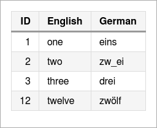 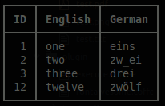

__With mask settings__

``` coffee
table = new Table [
  ['ID', 'English', 'German']
  [1, 'one', 'eins']
  [2, 'two', 'zw_ei']
  [3, 'three', 'drei']
  [12, 'twelve', 'zwölf']
]

report = new Report()
report.table table, null, null, true
```

``` markdown
| ID | English | German |
|:-- |:------- |:------ |
| 1  | one     | eins   |
| 2  | two     | zw\_ei |
| 3  | three   | drei   |
| 12 | twelve  | zwölf  |
```

And renders as HTML:


with list-map
---------------------------------------------------------------------

``` coffee
table = [
  {id: 1, en: 'one', de: 'eins'}
  {id: 2, en: 'two', de: 'zwei'}
  {id: 3, en: 'three', de: 'drei'}
  {id: 12, en: 'twelve', de: 'zwölf'}
]

report = new Report()
report.table table
```

``` markdown
| id | en     | de    |
|:-- |:------ |:----- |
| 1  | one    | eins  |
| 2  | two    | zwei  |
| 3  | three  | drei  |
| 12 | twelve | zwölf |
```

And renders as HTML and console output:

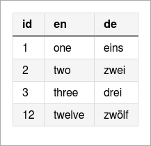

__Using column map-map__

``` coffee
table = [
  {id: 1, en: 'one', de: 'eins'}
  {id: 2, en: 'two', de: 'zwei'}
  {id: 3, en: 'three', de: 'drei'}
  {id: 12, en: 'twelve', de: 'zwölf'}
]
columns =
  id:
    title: 'ID'
    align: 'right'
  de:
    title: 'German'
  en:
    title: 'English'

report = new Report()
report.table table, columns
```

``` markdown
| ID | German | English |
| --:|:------ |:------- |
|  1 | eins   | one     |
|  2 | zwei   | two     |
|  3 | drei   | three   |
| 12 | zwölf  | twelve  |
```

And renders as HTML and console output:

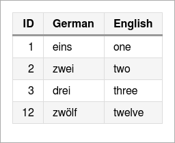 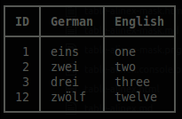

__Using column list-map__

``` coffee
table = [
  {id: 1, en: 'one', de: 'eins'}
  {id: 2, en: 'two', de: 'zwei'}
  {id: 3, en: 'three', de: 'drei'}
  {id: 12, en: 'twelve', de: 'zwölf'}
]
columns = [
  ['id', 'en']
  ['ID', 'English']
]

report = new Report()
report.table table, columns
```

``` markdown
| ID | English |
|:-- |:------- |
| 1  | one     |
| 2  | two     |
| 3  | three   |
| 12 | twelve  |
```

And renders as HTML:


__Using column list__

``` coffee
table = [
  {id: 1, en: 'one', de: 'eins'}
  {id: 2, en: 'two', de: 'zwei'}
  {id: 3, en: 'three', de: 'drei'}
  {id: 12, en: 'twelve', de: 'zwölf'}
]
columns = ['ID', 'English', 'German']

report = new Report()
report.table table, columns
```

``` markdown
| ID | English | German |
|:-- |:------- |:------ |
| 1  | one     | eins   |
| 2  | two     | zwei   |
| 3  | three   | drei   |
| 12 | twelve  | zwölf  |
```

And renders as HTML:

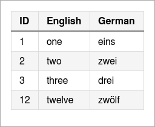

__Using column map__

``` coffee
table = [
  {id: 1, en: 'one', de: 'eins'}
  {id: 2, en: 'two', de: 'zwei'}
  {id: 3, en: 'three', de: 'drei'}
  {id: 12, en: 'twelve', de: 'zwölf'}
]
columns =
  id: 'ID'
  en: 'English'

report = new Report()
report.table table, columns
```

``` markdown
| ID | English |
|:-- |:------- |
| 1  | one     |
| 2  | two     |
| 3  | three   |
| 12 | twelve  |
```

And renders as HTML:

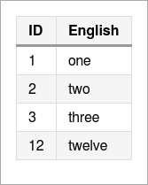

__Using sort map__

``` coffee
table = [
  {id: 1, en: 'one', de: 'eins'}
  {id: 2, en: 'two', de: 'zwei'}
  {id: 3, en: 'three', de: 'drei'}
  {id: 12, en: 'twelve', de: 'zwölf'}
]
columns =
  id:
    title: 'ID'
    align: 'right'
  de:
    title: 'German'
  en:
    title: 'English'
sort = {de: 'desc'}

report = new Report()
report.table table, columns, sort
```

``` markdown
| ID | German | English |
| --:|:------ |:------- |
| 12 | zwölf  | twelve  |
|  2 | zwei   | two     |
|  1 | eins   | one     |
|  3 | drei   | three   |
```

And renders as HTML:

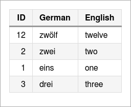

__Using sort list__

``` coffee
table = [
  {id: 1, en: 'one', de: 'eins'}
  {id: 2, en: 'two', de: 'zwei'}
  {id: 3, en: 'three', de: 'drei'}
  {id: 12, en: 'twelve', de: 'zwölf'}
]
columns =
  id:
    title: 'ID'
    align: 'right'
  de:
    title: 'German'
  en:
    title: 'English'
sort = ['de']

report = new Report()
report.table table, columns, sort
```

``` markdown
| ID | German | English |
| --:|:------ |:------- |
|  3 | drei   | three   |
|  1 | eins   | one     |
|  2 | zwei   | two     |
| 12 | zwölf  | twelve  |
```

And renders as HTM:

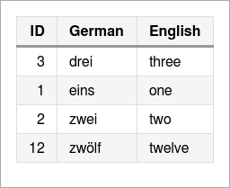

__Using sort key__

``` coffee
table = [
  {id: 1, en: 'one', de: 'eins'}
  {id: 2, en: 'two', de: 'zwei'}
  {id: 3, en: 'three', de: 'drei'}
  {id: 12, en: 'twelve', de: 'zwölf'}
]
columns =
  id:
    title: 'ID'
    align: 'right'
  de:
    title: 'German'
  en:
    title: 'English'
sort = 'de'

report = new Report()
report.table table, columns, sort
```

``` markdown
| ID | German | English |
| --:|:------ |:------- |
|  3 | drei   | three   |
|  1 | eins   | one     |
|  2 | zwei   | two     |
| 12 | zwölf  | twelve  |
```

And renders as HTML:


with list array
-----------------------------------------------------------------

``` coffee
table = [
  [1, 'one', 'eins']
  [2, 'two', 'zwei']
  [3, 'three', 'drei']
  [12, 'twelve', 'zwölf']
]
report = new Report()
report.table table
```

``` markdown
| 1  | one    | eins  |
|:-- |:------ |:----- |
| 2  | two    | zwei  |
| 3  | three  | drei  |
| 12 | twelve | zwölf |
```

And renders as HTML:


__Using column list__

``` coffee
table = [
  [1, 'one', 'eins']
  [2, 'two', 'zwei']
  [3, 'three', 'drei']
  [12, 'twelve', 'zwölf']
]
columns = ['ID', 'English', 'German']

report = new Report()
report.table table, columns
```

``` markdown

| ID | English | German |
|:-- |:------- |:------ |
| 1  | one     | eins   |
| 2  | two     | zwei   |
| 3  | three   | drei   |
| 12 | twelve  | zwölf  |
```

And renders as HTML:


__Using column list-array__

``` coffee
table = [
  [1, 'one', 'eins']
  [2, 'two', 'zwei']
  [3, 'three', 'drei']
  [12, 'twelve', 'zwölf']
]
columns = [
  [0, 1]
  ['ID', 'English']
]

report = new Report()
report.table table, columns
```

``` markdown
| ID | English |
|:-- |:------- |
| 1  | one     |
| 2  | two     |
| 3  | three   |
| 12 | twelve  |
```

And renders as HTML:


__Using column list-map__

``` coffee
table = [
  [1, 'one', 'eins']
  [2, 'two', 'zwei']
  [3, 'three', 'drei']
  [12, 'twelve', 'zwölf']
]
columns = [
  title: 'ID'
  align: 'right'
,
  title: 'English'
,
  title: 'German'
]

report = new Report()
report.table table, columns
```

``` markdown
| ID | English | German |
| --:|:------- |:------ |
|  1 | one     | eins   |
|  2 | two     | zwei   |
|  3 | three   | drei   |
| 12 | twelve  | zwölf  |
```

And renders as HTML:


__With empty fields__

``` coffee
table = [
  [1, 'one', 'eins']
  [2, '', 'zwei']
  [3, null, 'drei']
  [12, undefined, 'zwölf']
]
report = new Report()
report.table table
```

``` markdown

| 1  | one | eins  |
|:-- |:--- |:----- |
| 2  |     | zwei  |
| 3  |     | drei  |
| 12 |     | zwölf |
```

And renders as HTML:

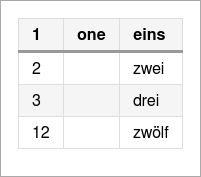

with map
----------------------------------------------------------------------

``` coffee
table =
  id: '001'
  name: 'alex'
  position: 'developer'
report = new Report()
report.table table
```

``` markdown
| Name     | Value     |
|:-------- |:--------- |
| id       | 001       |
| name     | alex      |
| position | developer |
```

And renders as HTML:

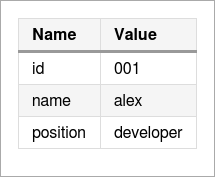

__Using volumn list__

``` coffee
table =
  id: '001'
  name: 'alex'
  position: 'developer'
report = new Report()
report.table table
```

``` markdown
| NAME     | VALUE     |
|:-------- |:--------- |
| id       | 001       |
| name     | alex      |
| position | developer |
```

And renders as HTML:

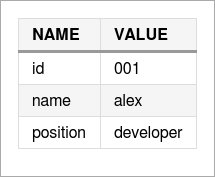

__With list and object content__

``` coffee
table =
  number: [1..8]
  name: 'alex'
  data:
    type: 'developer'
    lang: 'javascript'
report = new Report()
report.table table
```

``` markdown
| Name      | Value                  |
|:--------- |:---------------------- |
| number    | 1, 2, 3, 4, 5, 6, 7, 8 |
| name      | alex                   |
| data.type | developer              |
| data.lang | javascript             |
```

And renders as HTML:

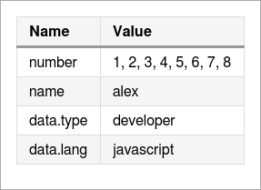


Interactive Table
---------------------------------------------------------------
Instead of simple tables for the HTML output they may be made interactive, allowing:

- sorting
- filtering
- paging

All these may be done by the user. But if such tables are outputted to other format
they will only show a normal table. It is also not possible to run this in most
mail clients (only if attached and opened in Browser).

``` coffee
report = new Report()
report.datatable new Table([
  ['ID', 'English', 'German']
  [1, 'one', 'eins']
  [2, 'two', 'zw_ei']
  [3, 'three', 'drei']
  [12, 'twelve', 'zwölf']
])
```

The possible options to give as second parameter are documented at the jQuery
[datatable](https://datatables.net/examples/styling/order-column.html). The default
will disable paging, search and info.

As markdown this will be written as three separate elements working together:

``` markdown
| ID | English | German |
|:-- |:------- |:------ |
| 1  | one     | eins   |
| 2  | two     | zw_ei  |
| 3  | three   | drei   |
| 12 | twelve  | zwölf  |
<!-- {table:#datatable1} -->
$$$ js
$(document).ready(function () {
  $('#datatable1').DataTable({
  "paging": false,
  "info": false
});
});
$$$
```

And finally in HTML this will look like (click to show working HTML):

[](http://htmlpreview.github.io/?https://github.com/alinex/node-report/blob/master/src/examples/datatable.html)

__Features__

In this example a lot of features are activated:

- info - (boolean) show information about the table including information about filtered
  data (default: false, true in markdown)
- paging - (boolean) set to true to enable paging of data (default: false, true in markdown)
- lengthChange - (boolean) control the end user's ability to change the paging display length of the table if paging is enabled (default: true)
- ordering - (boolean)  control ordering/sorting abilities in table (default: true)
- searching - (boolean) control search/filtering abilities (default: false, true in markdown)
- scrollX - (boolean) enable horizontal scrolling if necessary for viewport
- scrollY - (boolean) enable vertical scrolling if necessary for viewport

``` coffee
report = new Report()
report.datatable new Table([
  ['ID', 'English', 'German']
  [1, 'one', 'eins']
  [2, 'two', 'zwei']
  [3, 'three', 'drei']
  [4, 'four', 'vier']
  [5, 'five', 'fünf']
  [6, 'six', 'sechs']
  [7, 'seven', 'sieben']
  [8, 'eight', 'acht']
  [9, 'nine', 'neun']
  [10, 'ten', 'zehn']
  [11, 'eleven', 'elf']
  [12, 'twelve', 'zwölf']
]),
  info: true
  paging: true
  searching: true
```

As markdown this will be written as follows:

``` markdown
| ID | English | German |
|:-- |:------- |:------ |
| 1  | one     | eins   |
| 2  | two     | zwei   |
| 3  | three   | drei   |
| 4  | four    | vier   |
| 5  | five    | fünf   |
| 6  | six     | sechs  |
| 7  | seven   | sieben |
| 8  | eight   | acht   |
| 9  | nine    | neun   |
| 10 | ten     | zehn   |
| 11 | eleven  | elf    |
| 12 | twelve  | zwölf  |
<!-- {table:#datatable1} -->
$$$ js
$(document).ready(function () {
  $('#datatable1').DataTable({
  "info": true,
  "paging": true,
  "searching": true
});
});
$$$
```

And finally in HTML this will look like (click to show working HTML):

[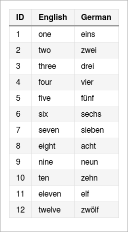](http://htmlpreview.github.io/?https://github.com/alinex/node-report/blob/master/src/examples/datatable-features.html)
