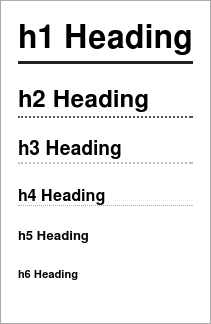
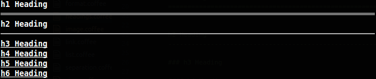

Headings
==========================================================================

Use the methods h1 to h6 to create headings in the given level:

``` coffee
report = new Report()
report.h1 'My Title'
report.h2 'Subheading with specific width', 120
```

In the headings level 1 and 2 it is possible to give a width for the line length
as shown above.

``` markdown
h1 Heading
==========================================================================

h2 Heading
--------------------------------------------------------------------------

### h3 Heading

#### h4 Heading

##### h5 Heading

###### h6 Heading
```

With the default style this should look like:

 

Alternatively the first two levels may be also defined as:

``` markdown
# h1 Heading

## h2 Heading
```
