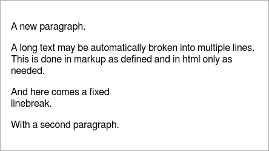
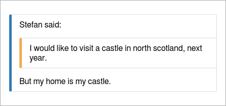
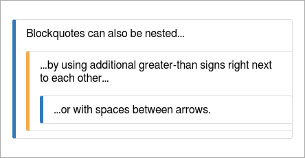

Blocks
=====================================================================
This allows the following types:

- p - add a text paragraph
- quote - add quoted text multiple level depth (second parameter)
- code - add a code block (language as additional parameter)
- box - add a visual box of any content


Paragraph
---------------------------------------------------------------------
Use it for a normal text paragraph.

``` coffee
report.p 'A new paragraph.'
report.p 'A long text may be automatically broken into multiple lines.', 40
report.p 'And here comes a fixed\n linebreak.\n\nWith a second paragraph.'
```

You may give the line length for markdown as optional second parameter.

This goes into html as:

``` markdown
A new paragraph.

A long text may be automatically broken
into multiple lines.

And here comes a fixed\
linebreak.

With a second paragraph.
```

In markdown you write your text directly, line breaks will not be held but made
like needed. An empty line starts a new paragraph but if you need a line break
on a specific position use a slash at the end.

And renders in HTML as:




Quote
----------------------------------------------------------------------
Quoted text is used if you show another opinion and it may also be multiple level
deep. It is like used in emails.


``` coffee
report.quote 'My home is my castle!'
report.quote "I would like to visit a castle in north scotland, next year.", 2, 40
```

Parameters:

- (string) text for thee quote
- (integer) depth level 1.. (default: 1)
- (integer) max width in markdown

This makes two quotes in different levels.
You may give the quoting depth as second parameter and maybe the line length for
markdown as third parameter.

``` markdown
> My home is my castle!

> > I would like to visit a castle in
> > north scotland, next year.
```

But you can also make stacked quotes liek:

``` coffee
report.quote 'Stefan said:' +
Report.quote("I would like to visit a castle in north scotland, next year.") +
"But my home is my castle."
```

This will be:

``` markdown
> Stefan said:
> > I would like to visit a castle in north scotland, next year.
> But my home is my castle.
```

::: warning
This work's not as expected in the moment and the last line will be interpreted
as belonging to the second one. This is based on the
[CommonMark Spec](http://spec.commonmark.org/).
:::

An alternative format is:

``` markdown
> Blockquotes can also be nested...
>> ...by using additional greater-than signs right next to each other...
> > > ...or with spaces between arrows.
```

And renders as HTML the three examples will look like:

  


Preformatted Text
---------------------------------------------------------------------
This is used for any text which you didn't have a specific language but should alsobe
displayed as a preformatted block.

``` coffee
report.code 'This is a text code block.\nIt should be kept as is.'
```

In the markdown this is represented with a block of at leasr three back quotes:

```` markdown
    This is a text code block.
    It should be kept as is.
````

And renders as HTML:


Code Highlighting
--------------------------------------------------------------------------
To display some code you can create a paragraph with syntax highlighting (only HTML)
in languages like:

- code like: bash, coffee, js, sh, sql
- data like: json, yaml
- documents like: handlebars, markdown

See [highlight.js](https://highlightjs.org/static/demo/) for all possible languages
to use.

``` coffee
report.code 'var x = Math.round(f);', 'js'
report.code 'This **is** a ==markdown== text', 'markdown'
report.code 'simple:\n  list: [a, b, 5]', 'yaml'
```

In the markdown this is represented with a block of at least three back quotes
followed by the language to use:

```` markdown
``` js
var x = Math.round(f);
```

``` markdown
This **is** a ==markdown== text
```

``` yaml
simple:
  list: ["a", b, 5]
```
````

And renders as HTML:


Use more backquotes if your content may contain three backquotes.


Box
------------------------------------------------------------------
The following code makes a colored box around a markup text which may contain
any other markup. As second parameter the type of the box needs to be given
which is one of: 'detail', 'info', 'warning', 'alert' (alias 'error').

``` coffee
report.box "Some more details here...", 'detail'
report.box "A short note.", 'info'
report.box "This is important!", 'warning'
report.box "Something went wrong!", 'alert'
```

An additional title text and width parameter may also be given to customize title
and optimize display width in markdown.

In the markdown this is defined using driple colons as start and end with the
box type behind the start mark:

``` markdown
::: detail
Some more details here...
:::

::: info
A short note.
:::

::: warning
This is important!
:::

::: alert
Something went wrong!
:::
```

And renders as HTML or console output:

 

Markdown for additional tile will be:

``` markdown
::: info Short Note
A short note.
:::
```
