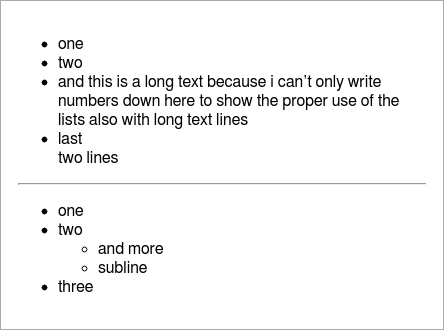
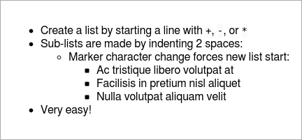
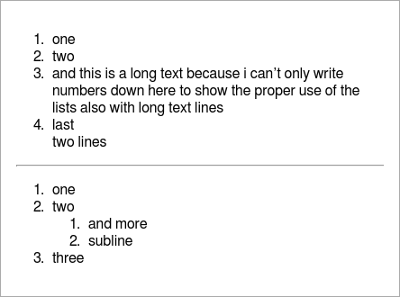
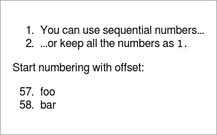
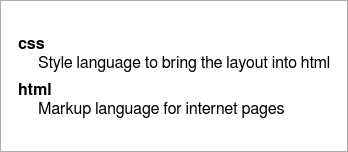
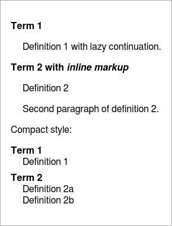
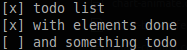

Lists
=====================================================================
Three types of lists are supported:

- ul - unordered list from array
- ol - ordered list from array
- dl - definition list from object
- check - list with check boxes

All this lists allow for alphanumeric sorting. Give `true` as second parameter or
`false` for reverse sorting but keep in mind that this is only working correctly
in straight lists (not sublists).
Also an additional width parameter for the markdown display width may be given as
third paramter.


Unordered List
----------------------------------------------------------------------
This will create a list with bullets.

``` coffee
report.ul [
  'one'
  'two'
  "and this is a long text because i can't only write numbers
  down here to show the proper use of the lists also with long text lines" 'last\ntwo lines'
report.hr()
report.ul [
  'one'
  'two'
  ['subline', 'and more']
  'three'
]
```

In the markdown the same list is defined as:

``` markdown
- one
- two
- and this is a long text because i can't only write numbers down here to show
  the proper use of the lists also with long text lines
- last\
  two lines

---

- one
- two
  - and more
  - subline
- three
```

Alternatively `*`, `+` or `-` may also be used as list symbols, also in mixed
format.

``` markdown
+ Create a list by starting a line with `+`, `-`, or `*`
+ Sub-lists are made by indenting 2 spaces:
  - Marker character change forces new list start:
    * Ac tristique libero volutpat at
    + Facilisis in pretium nisl aliquet
    - Nulla volutpat aliquam velit
+ Very easy!
```

And renders as HTML:

 


Ordered List
----------------------------------------------------------------------
This will create a numbered list.

``` coffee
report.ol [
  'one'
  'two'
  "and this is a long text because i can't only write numbers
  down here to show the proper use of the lists also with long text lines" 'last\ntwo lines'
report.hr()
report.ol [
  'one'
  'two'
  ['subline', 'and more']
  'three'
]
```

In the markdown the same list is defined as:

``` markdown
1. one
2. two
3. and this is a long text because i can't only write numbers down here to show
   the proper use of the lists also with long text lines
4. last\
   two lines

---

1. one
2. two
   1. and more
   2. subline
3. three
```

It doesn't matter if you give the same number multiple times, only the first number's
value is used to start numbering. To start at a specific number start with it:

``` markdown
1. You can use sequential numbers...
1. ...or keep all the numbers as `1.`

Start numbering with offset:

57. foo
1. bar
```

And renders as HTML:

 


Definition List
----------------------------------------------------------------------
This will display some phrases as list entries with their contents.

``` coffee
report.dl
  html: 'Markup language for internet pages'
  css: 'Style language to bring the layout into html'
, true
```

Like seen in the example the sorting may be set to true.

In the markdown the same list is defined as:

``` markdown
css

: Style language to bring the layout into html

html

: Markup language for internet pages
```

In the markdown you may also use:

``` markdown
Term 1

:   Definition 1
with lazy continuation.

Term 2 with *inline markup*

:   Definition 2

    Second paragraph of definition 2.

Compact style:

Term 1
  ~ Definition 1

Term 2
  ~ Definition 2a
  ~ Definition 2b
```

And renders as HTML:

 


Check Lists
---------------------------------------------------------------------
A check list in which each row maybe done or not.

``` coffee
report.check
  'todo list': true
  'with elements done': true
  'and something todo': false
```

The values in the given map defines if they are done or not.

As markdown this is written as:

``` markdown
[x] todo list
[x] with elements done
[ ] and something todo
```

And renders as HTML and console output:

 
