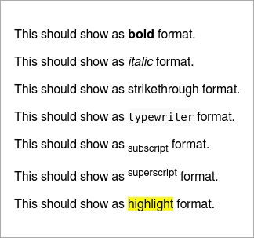

Inline Formats
====================================================================

These are only available on static calls not on a report instance! But you may add
them into another instance method.

- b - bold like `__bold__`
- i - italic like `_italic_`
- del - delete like `~~delete~~`
- sub - subscript like `~subscript~`
- sup - superscript like `^superscript^`
- tt - typewriter like \`typewriter\`
- mark - marked text like highlighted with an text marker like `==marked==`

``` coffee
report.p "This should show as #{Report.b "bold"} format."
report.p "This should show as #{Report.i "italic"} format."
report.p "This should show as #{Report.del "strikethrough"} format."
report.p "This should show as #{Report.tt "typewriter"} format."
report.p "This should show as #{Report.sub "subscript"} format."
report.p "This should show as #{Report.sup "superscript"} format."
report.p "This should show as #{Report.mark "highlight"} format."
```

You may also combine this calls feeding one result into the other method:

``` coffee
report.p "Water has the formula " + Report.b("H#{Report.sub 2}O") + " *v* ."
```

The markdown will look like:

``` markdown
This should show as __bold__ format.

This should show as _italic_ format.

This should show as ~~strikethrough~~ format.

This should show as `typewriter` format.

This should show as ~subscript~ format.

This should show as ^superscript^ format.

This should show as ==highlight== format.
```

As an alternative syntax you may use `*italic*` or `**bold**` for this formats, too.

The complex example from above will look like:

``` markdown
Water has the formula __H~2~O__.
```

And renders as HTML:

 

And also in console some formats are interpreted:


