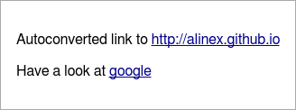
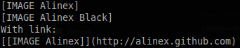

Links and Images
=====================================================================


Links
------------------------------------------------------------------
If you add a link you can give the full url in the text or add the link  as an
inline element with:

- link text
- url
- title text shown as tooltip in html (optional)

``` coffee
report.p "Autoconverted link to http://alinex.github.io"
link = Report.a 'google', 'http://google.com', 'Open Google Search'
report.p "Have a look at #{link}"
```

As markdown the link text goes into square brackets, the url in brackets with the optional title text in quotes within:

``` markdown
Autoconverted link to http://alinex.github.io

Have a look at [google](http://google.com "Open Google Search")
```

And renders as HTML:



Console and text output will be the same as markdown.


Images
-------------------------------------------------------------------
Images may be added nearly the same way as links. The parameters are:

- alternative text
- url
- title text shown as tooltip in html (optional)

``` coffee
report.p Report.img 'Alinex', 'https://alinex.github.io/images/Alinex-200.png'
report.p Report.img 'Alinex Black', 'https://alinex.github.io/images/Alinex-black-200.png', "The Alinex Logo"
image = Report.img 'Alinex', 'https://alinex.github.io/images/Alinex-200.png'
report.p "With link: " + Report.a image, 'http://alinex.github.com'
```

The markdown also looks the same as for links with an exclamation mark before:

``` markdown


With link:
[](http://alinex.github.com)
```

With a link the image goes into the square brackets of the link text.

And renders as HTML and console output:

 

The text conversion is the same as conspole output.
