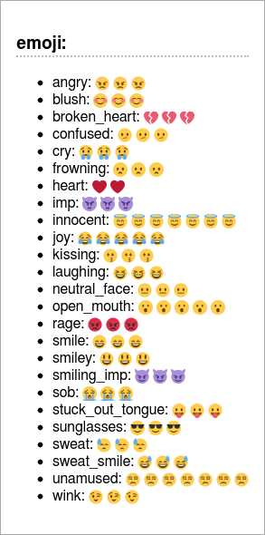
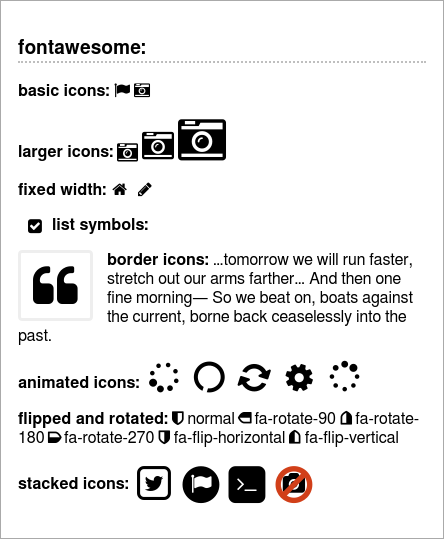

Special Signs
===============================================================
You may also include some special signs.


Typographic
-----------------------------------------------------------------

``` coffee
report.h3 "classic typographs: "
report.ul [
  "copyright:   (c) (C)"
  "registeres:  (r) (R) "
  "trademark:   (tm) (TM) "
  "paragraph:   (p) (P) "
  "math:        +-"
]
```

``` markdown
### classic typographs

- copyright:   (c) (C)
- registeres:  (r) (R)
- trademark:   (tm) (TM)
- paragraph:   (p) (P)
- math:        +-
```

And renders as HTML and console output:

 


Emoji
------------------------------------------------------------------

``` coffee
report.h3 "emoji:"
report.ul [
  """angry:            :angry:            >:(     >:-("""
  """blush:            :blush:            :")     :-")"""
  """broken_heart:     :broken_heart:     </3     <\\3"""
  """confused:         :confused:         :/      :-/"""
  """cry:              :cry:              :,(   :,-("""
  """frowning:         :frowning:         :(      :-("""
  """heart:            :heart:            <3"""
  """imp:              :imp:              ]:(     ]:-("""
  """innocent:         :innocent:         o:)     O:)     o:-)      O:-)      0:)     0:-)"""
  """joy:              :joy:              :,)      :,-)   :,D      :,-D"""
  """kissing:          :kissing:          :*      :-*"""
  """laughing:         :laughing:         x-)     X-)"""
  """neutral_face:     :neutral_face:     :|      :-|"""
  """open_mouth:       :open_mouth:       :o      :-o     :O      :-O"""
  """rage:             :rage:             :@      :-@"""
  """smile:            :smile:            :D      :-D"""
  """smiley:           :smiley:           :)      :-)"""
  """smiling_imp:      :smiling_imp:      ]:)     ]:-)"""
  """sob:              :sob:              ;(     ;-("""
  """stuck_out_tongue: :stuck_out_tongue: :P      :-P"""
  """sunglasses:       :sunglasses:       8-)     B-)"""
  """sweat:            :sweat:            ,:(     ,:-("""
  """sweat_smile:      :sweat_smile:      ,:)     ,:-)"""
  """unamused:         :unamused:         :s      :-S     :z      :-Z     :$      :-$"""
  """wink:             :wink:             ;)      ;-)"""
]
```

``` markdown
### emoji:

- angry:            :angry:            >:(     >:-(
- blush:            :blush:            :")     :-")
- broken_heart:     :broken_heart:     </3     <\3
- confused:         :confused:         :/      :-/
- cry:              :cry:              :,(   :,-(
- frowning:         :frowning:         :(      :-(
- heart:            :heart:            <3
- imp:              :imp:              ]:(     ]:-(
- innocent:         :innocent:         o:)     O:)     o:-)      O:-)      0:)
     0:-)
- joy:              :joy:              :,)      :,-)   :,D      :,-D
- kissing:          :kissing:          :*      :-*
- laughing:         :laughing:         x-)     X-)
- neutral_face:     :neutral_face:     :|      :-|
- open_mouth:       :open_mouth:       :o      :-o     :O      :-O
- rage:             :rage:             :@      :-@
- smile:            :smile:            :D      :-D
- smiley:           :smiley:           :)      :-)
- smiling_imp:      :smiling_imp:      ]:)     ]:-)
- sob:              :sob:              ;(     ;-(
- stuck_out_tongue: :stuck_out_tongue: :P      :-P
- sunglasses:       :sunglasses:       8-)     B-)
- sweat:            :sweat:            ,:(     ,:-(
- sweat_smile:      :sweat_smile:      ,:)     ,:-)
- unamused:         :unamused:         :s      :-S     :z      :-Z     :$     
  :-$
- wink:             :wink:             ;)      ;-)
```

And renders as HTML:



Text and console output are the same as the markdown.


Font Awesome
------------------------------------------------------------------------
Font Awesome gives you scalable vector icons that can instantly be customized — size,
color, drop shadow, and anything that can be done with the power of CSS.
You can use all the icons from [FontAwesome](http://fontawesome.io/icons/) to add
to your markup (html only):

``` coffee
report.h3 "fontawesome:"
report.p "basic icons:   :fa-flag:    :fa-camera-retro:"
report.p "larger icons:  :fa-camera-retro fa-lg: :fa-camera-retro fa-2x: :fa-camera-retro fa-3x:"
report.p "fixed width:   :fa-home fa-fw:   :fa-pencil fa-fw:"
report.ul [
  "<!-- {ul:.fa-ul}-->"
  "list symbols:  :fa-li fa-check-square:"
]
report.p ":fa-quote-left fa-3x fa-pull-left fa-border:
  ...tomorrow we will run faster, stretch out our arms farther...
  And then one fine morning— So we beat on, boats against the
  current, borne back ceaselessly into the past."
report.p "animated icons:    :fa-spinner fa-spin fa-2x fa-fw:
  :fa-circle-o-notch fa-spin fa-2x fa-fw:
  :fa-refresh fa-spin fa-2x fa-fw:
  :fa-cog fa-spin fa-2x fa-fw:
  :fa-spinner fa-pulse fa-2x fa-fw:"
report.p "flipped and rotated:   :fa-shield: normal
  :fa-shield fa-rotate-90: fa-rotate-90
  :fa-shield fa-rotate-180: fa-rotate-180
  :fa-shield fa-rotate-270: fa-rotate-270
  :fa-shield fa-flip-horizontal: fa-flip-horizontal
  :fa-shield fa-flip-vertical: fa-flip-vertical"
report.p "stacked icons:
  :fa-stack fa-lg fa-stack-2x fa-square-o fa-stack-1x fa-twitter:
  :fa-stack fa-lg fa-stack-2x fa-circle fa-stack-1x fa-flag fa-inverse:
  :fa-stack fa-lg fa-stack-2x fa-square fa-stack-1x fa-terminal fa-inverse:
  :fa-stack fa-lg fa-stack-1x fa-camera fa-stack-2x fa-ban text-danger:"
```

- __Basic Icons__

  You can place Font Awesome icons just about anywhere as inline text using the icon's
  name. The icon size and color will match the surrounding text paragraph.

  - __Colors__

  Use the classes `text-red`, `text-green`, `text-yellow`, `text-blue`, `text-magenta`, `text-cyan`
  or `text-gray` to change the colors.

- __Larger Icons__

  To increase icon sizes relative to their container, use the `fa-lg` (33% increase),
  `fa-2x`, `fa-3x`, `fa-4x`, or `fa-5x` classes.

- __Fixed Width__

  Use `fa-fw` to set icons at a fixed width. Great to use when different icon widths
  throw off alignment. Especially useful in things like lists.

- __List Icons__

  Use `fa-ul` and `fa-li` to easily replace default bullets in unordered lists.

- __Bordered Icons__

  Use `fa-border` and `fa-pull-right` or `fa-pull-left` for easy pull quotes or article icons.

- __Animated Icons__

  Use the `fa-spin` class to get any icon to rotate, and use `fa-pulse` to have it rotate
  with 8 steps. Works well with `fa-spinner`, `fa-refresh` and `fa-cog`.

- __Flipped and Rotated__

  To arbitrarily rotate and flip icons, use the `fa-rotate-*` and `fa-flip-*` classes.

- __Stacked Icons__

  To stack multiple icons, use the `fa-stack-1x` as start for the regularly sized icon, and
  `fa-stack-2x` for the larger icon and the icon itself with it's manipulations like `fa-inverse`
  behind.

``` markdown
### fontawesome:

__basic icons:__   :fa-flag:    :fa-camera-retro:

__larger icons:__  :fa-camera-retro fa-lg: :fa-camera-retro fa-2x:
:fa-camera-retro fa-3x:

__fixed width:__   :fa-home fa-fw:   :fa-pencil fa-fw:

- <!-- {ul:.fa-ul}-->
- __list symbols:__  :fa-li fa-check-square:

:fa-quote-left fa-3x fa-pull-left fa-border: __border icons:__ ...tomorrow we
will run faster, stretch out our arms farther... And then one fine morning— So
we beat on, boats against the current, borne back ceaselessly into the past.

__animated icons:__    :fa-spinner fa-spin fa-2x fa-fw: :fa-circle-o-notch
fa-spin fa-2x fa-fw: :fa-refresh fa-spin fa-2x fa-fw: :fa-cog fa-spin fa-2x
fa-fw: :fa-spinner fa-pulse fa-2x fa-fw:

__flipped and rotated:__   :fa-shield: normal :fa-shield fa-rotate-90:
fa-rotate-90 :fa-shield fa-rotate-180: fa-rotate-180 :fa-shield fa-rotate-270:
fa-rotate-270 :fa-shield fa-flip-horizontal: fa-flip-horizontal :fa-shield
fa-flip-vertical: fa-flip-vertical

__stacked icons:__ :fa-lg fa-stack-2x fa-square-o fa-stack-1x fa-twitter: :fa-lg
fa-stack-2x fa-circle fa-stack-1x fa-flag fa-inverse: :fa-lg fa-stack-2x
fa-square fa-stack-1x fa-terminal fa-inverse: :fa-lg fa-stack-1x fa-camera
fa-stack-2x fa-ban text-red:
```

And renders as HTML and console output:

 

In text and console output only the icons are kept in a compressed format. All modulations
are removed.
