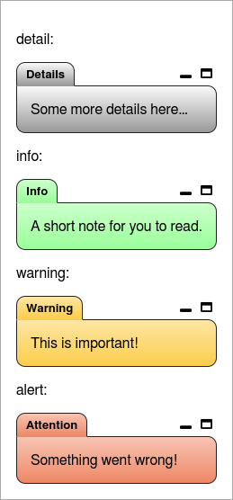
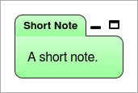
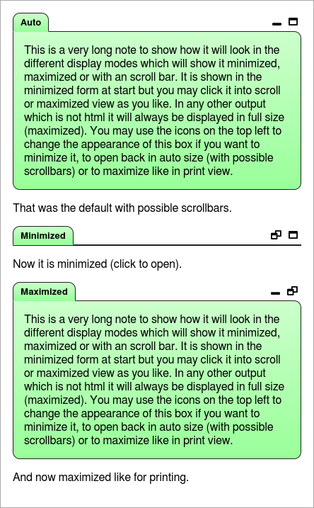

Tabbed Boxes
=====================================================================
This allows you to make some highlighting boxes arround any content.

- display with heading in markdown
- display as tabbed boxes in html
- stack multible boxes coming behind each other in html
- allow different sizes in html


Simple Box
------------------------------------------------------------------
The following code makes a colored box around a markup text which may contain
any other markup. As second parameter the type of the box needs to be given
which is one of: 'detail', 'info', 'warning', 'alert' (alias 'error').

``` coffee
report.p "detail:"
report.box "Some more details here...", 'detail'
report.p "info:"
report.box "A short note.", 'info'
report.p "warning:"
report.box "This is important!", 'warning'
report.p "alert:"
report.box "Something went wrong!", 'alert'
```

An additional title text and width parameter may also be given to customize title
and optimize display width in markdown.

In the markdown this is defined using driple colons as start and end with the
box type behind the start mark:

``` markdown
detail:

::: detail
Some more details here...
:::

info:

::: info
A short note.
:::

earning:

::: warning
This is important!
:::

alert:

::: alert
Something went wrong!
:::
```

And renders as HTML or console output:

 


Specific Title
-----------------------------------------------------------------
Often you want to define the title of the box by yourself. This is possible using
the third parameter:

``` coffee
report.box "A short note.", 'info', 'Short Note'
```

Markdown for own title will be:

``` markdown
::: info Short Note
A short note.
:::
```

And renders as HTML or console output:

 


Multiple Tabs
-----------------------------------------------------------------
If you add multiple boxes directly behind each other then they will be stacked
in html.

``` coffee
report.box "Some more details here...", 'detail'
report.box "A short note.", 'info'
report.box "This is important!", 'warning'
report.box "Something went wrong!", 'alert'
```

The markdown will look like:

``` markdown
::: detail
Some more details here...
:::

::: info
A short note.
:::

::: warning
This is important!
:::

::: alert
Something went wrong!
:::
```

And renders as HTML or console output:

 


Specific Display
-----------------------------------------------------------------
To get a specific style you may control it using the direct style settings described
under {@link 11_html.md}:

``` coffee
report.box "This is a very long note to show how it will look in the different
display modes which will show it minimized, maximized or with an scroll bar.
It is shown in the minimized form at start but you may click it into scroll
or maximized view as you like. In any other output which is not html it will
always be displayed in full size (maximized). You may use the icons on the top
left to change the appearance of this box if you want to minimize it, to open
back in auto size (with possible scrollbars) or to maximize like in print
view.", 'info', 'Auto {size=scroll}'
report.p "That was the default with possible scrollbars."
report.box "This is a very long note to show how it will look in the different
display modes which will show it minimized, maximized or with an scroll bar.
It is shown in the minimized form at start but you may click it into scroll
or maximized view as you like. In any other output which is not html it will
always be displayed in full size (maximized). You may use the icons on the top
left to change the appearance of this box if you want to minimize it, to open
back in auto size (with possible scrollbars) or to maximize like in print
view.", 'info', 'Minimized {size=min}'
report.p "Now it is minimized (click to open)."
report.box "This is a very long note to show how it will look in the different
display modes which will show it minimized, maximized or with an scroll bar.
It is shown in the minimized form at start but you may click it into scroll
or maximized view as you like. In any other output which is not html it will
always be displayed in full size (maximized). You may use the icons on the top
left to change the appearance of this box if you want to minimize it, to open
back in auto size (with possible scrollbars) or to maximize like in print
view.", 'info', 'Maximized {size=max}'
report.p "And now maximized like for printing."
```

You can specify the `size` setting behind the title with the possible values:
- `min` - show tab block in minimized form (needs click to open)
- `scroll` - show box with pre defined max height and possible scroll bars
- `max` - shows box in maximized form

This will be rendered in HTML as:



Examples
-----------------------------------------------------------------
Some examples with different Content:

- pre
- code
- table
- visualization
