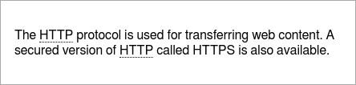
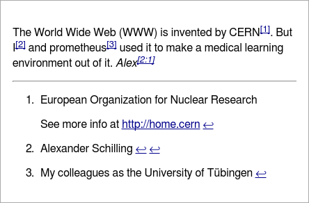

Document Elements
======================================================================

These elements willl add some functionality to the overall document.

Table of Contents
-----------------------------------------------------------------
This will add a table of contents as quicklink list to the resulting html document.
It will be removed on text and console output.

``` coffee
report = new Report()
report.toc()
report.h1 'Table of Contents Test'
report.h2 'My text'
report.p 'Something I have to say...'
report.h2 'Other opinions'
report.h3 'My parents'
report.p "You don't want to know."
report.h3 "My friends"
report.p 'They always support me.'
```

This will list all headings starting at level 2 in the quicklink list. The first
level headings are meant as document heading and therefore won't be listed in the
table.

In the markdown, all you have to do is add a `@[toc]` line there it should be added:

``` markdown
@[toc]


Table of Contents Test
================================================================================


My text
--------------------------------------------------------------------------------

Something I have to say...


Other opinions
--------------------------------------------------------------------------------

### My parents

You don't want to know.

### My friends

They always support me.
```

And renders as HTML you will find it on the right side (in the default style):


Separation
----------------------------------------------------------
A horizontal line may be used as seperation between text blocks.


``` coffee
report.p "My first line."
report.hr()
report.p "And another one after a separating line."
```

In the markdown this will be displayed with at least three dashes as a line:

``` markdown
My first line.

---

And another one after a separating line.
```

Alternatively you may use at least 3 or more undescores `___` or asterisk `***`
characters as a line.

And renders as HTML:

 


Abbreviations
-------------------------------------------------------------------
Add an abbreviation entry (before use in the text):

``` coffee
report = new Report()
report.abbr 'HTTP', 'Hyper Text Transfer Protocol'
report.p "The HTTP protocol is used for transferring web content. A secured
version of HTTP called HTTPS is also available."
```

``` markdown
The HTTP protocol is used for transferring web content. A secured version of
HTTP called HTTPS is also available.

*[HTTP]: Hyper Text Transfer Protocol
```

This will mark the words in the HTML text and add the definition as tooltip to it:




Footnotes
--------------------------------------------------------------------------
You may use footnotes within the document:


``` coffee
report = new Report()
cern = report.footnote "European Organization for Nuclear Research\n\nSee more info at http://home.cern"
me = report.footnote "Alexander Schilling", 'a'
other = report.footnote "My colleagues as the University of Tübingen", 'b'
report.p "The World Wide Web (WWW) is invented by CERN#{cern}. But I#{me} and
prometheus#{other} used it to make a medical learning environment out of it.
_Alex#{me}_"
```

Each time one of the footnotes added to the text only a reference (number or free defined)
is added and the contents of all footnotes are collected at the end of the document.

In the markdown the same reference (number or name) can be used multiple times to reference
the same footnote.

``` markdown
The World Wide Web (WWW) is invented by CERN[^1]. But I[^a] and prometheus[^b]
used it to make a medical learning environment out of it. _Alex[^a]_

[^1]: European Organization for Nuclear Research

      See more info at http://home.cern
[^a]: Alexander Schilling
[^b]: My colleagues as the University of Tübingen
```

And rendered as HTML links will be added in the text and backlinks from the footnotes.:


