Visualization
=======================================================================
This will only work in HTML format, else the definition is displayed.

All of the visual effects allow the use of additional style settings as the last
argument.

``` coffee
report = new Report()
report.qr "http://alinex.de", '.right'
```

This will be written in markdown as:

``` markdown
$$$ qr {.right}
http://alinex.de
$$$
```

Which will add a `float: right` style setting to the element.


QR Code
-----------------------------------------------------------
QR Codes are used to pack some information into a scanable 2D Object.

__Simple Code__

You only need to give the content like an URL:

``` coffee
report = new Report()
report.qr "http://alinex.de"
```

This will be written in markdown as:

``` markdown
$$$ qr
http://alinex.de
$$$
```

And finally in HTML and text or console output:

 

__QR Extended__

You may also define how to make the code image:

``` coffee
report = new Report()
report.qr
  content: 'http://alinex.github.io'
  padding: 1
  width: 500
  height: 500
  color: '#ff0000'
  background: '#ffffff'
  ecl: 'M'
```

``` markdown
$$$ qr
content: 'http://alinex.github.io'
padding: 1
width: 500
height: 500
color: '#ff0000'
background: '#ffffff'
ecl: M
$$$
```

And finally in HTML and text or console output:

 


Charts
------------------------------------------------------------
A lot of charts are possible based on [jui-chart](http://chartplay.jui.io/).
You'll find all possible settings there or look at some of the examples below.

``` coffee
report = new Report()
report.chart null, [
  ['quarter', 'sales', 'profit']
  ["1Q", 50, 35]
  ["2Q", 20, 100]
  ["3Q", 10, 5]
  ["4Q", 30, 25]
]
```

This makes a simple bar chart with predefined settings for your data. But you may
also specify a lot of options and charts. The examples below shows the possible
settings, but you only need to give some of them.

``` markdown
$$$ chart
| quarter | sales | profit |
|:------- |:----- |:------ |
| 1Q      | 50    | 35     |
| 2Q      | 20    | 100    |
| 3Q      | 10    | 5      |
| 4Q      | 30    | 25     |
$$$
```

This will render in HTML as (click to show in browser):

[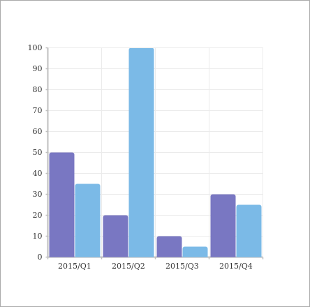](http://htmlpreview.github.io/?https://github.com/alinex/node-report/blob/master/src/examples/chart.html)

__Bar Chart__

``` coffee
report = new Report()
report.chart
  width: 400
  height: 400
  axis:
    y:
      type: 'block'
      domain: 'quarter'
      line: 'true'
    x:
      type: 'range'
      domain: 'profit'
      line: 'rect' # dashed with gradient
  brush: [
    type: 'bar'
    size: 15
    target: ['sales', 'profit']
    innerPadding: 10
  ]
  widget: [
    type: 'title'
    text: 'Bar Chart'
  ,
    type: 'legend'
  ,
    type: 'tooltip'
  ]
, [
  ['quarter', 'sales', 'profit']
  ["2015/Q1", 50, 35]
  ["2015/Q2", 20, 100]
  ["2015/Q3", 10, 5]
  ["2015/Q4", 30, 25]
]
```

``` markdown

$$$ chart
width: 400
height: 400
axis:
  'y':
    type: block
    domain: quarter
    line: 'true'
  x:
    type: range
    domain: profit
    line: rect
brush:
  - type: bar
    size: 15
    target:
      - sales
      - profit
    innerPadding: 10
widget:
  - type: title
    text: Bar Chart
  - type: legend
  - type: tooltip

| quarter | sales | profit |
|:------- |:----- |:------ |
| 2015/Q1 | 50    | 35     |
| 2015/Q2 | 20    | 100    |
| 2015/Q3 | 10    | 5      |
| 2015/Q4 | 30    | 25     |
$$$
```

This will render in HTML as (click to show in browser):

[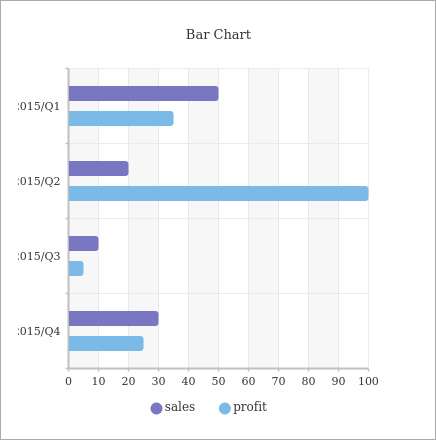](http://htmlpreview.github.io/?https://github.com/alinex/node-report/blob/master/src/examples/chart-bar.html)

__3D Bar Chart__

``` coffee
report = new Report()
report.chart
  width: 400
  height: 400
  axis:
    x:
      type: 'range'
      domain: 'profit'
      step: 5
    y:
      type: 'block'
      domain: 'quarter'
    c:
      type: 'grid3d'
      domain: ['sales', 'profit']
    depth: 20
    degree: 30
  brush: [
    type: 'bar3d'
    outerPadding: 10
    innerPadding: 5
  ]
  widget: [
    type: 'title'
    text: '3D Bar Chart'
  ,
    type: 'tooltip'
  ,
    type: 'legend'
  ]
, [
  ['quarter', 'sales', 'profit']
  ["2015/Q1", 50, 35]
  ["2015/Q2", 20, 100]
  ["2015/Q3", 10, 5]
  ["2015/Q4", 30, 25]
]
```

The markdown will contain the settings and the data table like above.

This will render in HTML as (click to show in browser):

[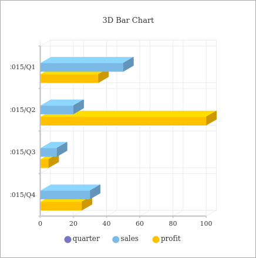](http://htmlpreview.github.io/?https://github.com/alinex/node-report/blob/master/src/examples/chart-bar-3d.html)

__Column Chart__

``` coffee
report = new Report()
report.chart
  width: 400
  height: 400
  axis:
    x:
      type: 'block'
      domain: 'quarter'
    y:
      type: 'range'
      domain: 'profit'
      step: 10
      line: true
  brush: [
    type: 'column'
    target: ['sales', 'profit']
  ,
    type: 'focus'
    start: 1
    end: 1
  ]
  widget: [
    type: 'title'
    text: 'Column Chart with Focus'
  ,
    type: 'tooltip'
  ,
    type: 'legend'
  ]
, [
  ['quarter', 'sales', 'profit']
  ["2015/Q1", 50, 35]
  ["2015/Q2", 20, 100]
  ["2015/Q3", 10, 5]
  ["2015/Q4", 30, 25]
]
```

The markdown will contain the settings and the data table like above.

This will render in HTML as (click to show in browser):

[](http://htmlpreview.github.io/?https://github.com/alinex/node-report/blob/master/src/examples/chart-column.html)

__3D Column Chart__

``` coffee
report = new Report()
report.chart
  width: 400
  height: 400
  axis:
    x:
      type: 'block'
      domain: 'quarter'
    y:
      type: 'range'
      domain: 'profit'
      step: 5
    c:
      type: 'grid3d'
      domain: ['sales', 'profit']
    depth: 20
    degree: 30
  brush: [
    type: 'column3d'
    outerPadding: 10
    innerPadding: 5
  ]
  widget: [
    type: 'title'
    text: '3D Column Chart'
  ,
    type: 'tooltip'
  ,
    type: 'legend'
  ]
, [
  ['quarter', 'sales', 'profit']
  ["2015/Q1", 50, 35]
  ["2015/Q2", 20, 100]
  ["2015/Q3", 10, 5]
  ["2015/Q4", 30, 25]
]
```

The markdown will contain the settings and the data table like above.

This will render in HTML as (click to show in browser):

[](http://htmlpreview.github.io/?https://github.com/alinex/node-report/blob/master/src/examples/chart-column-3d.html)

__Area Chart__

``` coffee
report = new Report()
report.chart
  width: 400
  height: 400
  axis:
    x:
      type: 'fullblock'
      domain: 'year'
      line: 'solid gradient'
    y:
      type: 'range'
      domain: [-100, 100]
      step: 10
      line: 'gradient dashed'
  brush: [
    type: 'area'
    symbol: 'curve'
    target: ['europe', 'switzerland', 'us']
  ]
  widget: [
    type: 'title'
    text: 'Area Chart'
  ,
    type: 'legend'
  ]
, [
  ['quarter', 'sales', 'profit']
  ["2015/Q1", 50, 35]
  ["2015/Q2", 20, 100]
  ["2015/Q3", 10, 5]
  ["2015/Q4", 30, 25]
]
```

The markdown will contain the settings and the data table like above.

This will render in HTML as (click to show in browser):

[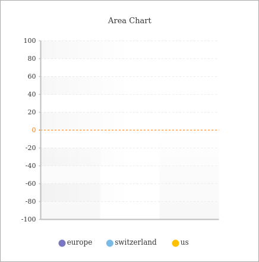](http://htmlpreview.github.io/?https://github.com/alinex/node-report/blob/master/src/examples/chart-area.html)


PlantUML
---------------------------------------------------------------------
A language to describe UML diagrams using simple text, which fits perfectly into markdown.
See [plantuml.com](http://plantuml.com/) for a complete language description.
Some examples will follow:

``` coffee
report = new Report()
report.plantuml "A -> B: Hello"
```

This sumple sequence diagram will be written into execution tags in markdown like:

``` markdown
$$$ plantuml
A -> B: Hello
$$$
```

And finally this will render in HTML or text/console as:

 

__Sequence Diagram__

``` coffee
report = new Report()
report.plantuml """
  participant User

  User -> A: DoWork
  activate A #FFBBBB

  A -> A: Internal call
  activate A #DarkSalmon

  A -> B: << createRequest >>
  activate B

  B --> A: RequestCreated
  deactivate B
  deactivate A
  A -> User: Done
  deactivate A
  """
```

The markdown is nearly the same but with `$$$ plantuml .... $$$` arround the code.

And this will render in HTML or text/console as:

 

__Use Case Diagram__

``` coffee
report = new Report()
report.plantuml """
  :Main Admin: as Admin
  (Use the application) as (Use)

  User -> (Start)
  User --> (Use)

  Admin ---> (Use)

  note right of Admin : This is an example.

  note right of (Use)
    A note can also
    be on several lines
  end note

  note "This note is connected to several objects." as N2
  (Start) .. N2
  N2 .. (Use)
  """
```

The markdown is nearly the same but with `$$$ plantuml .... $$$` arround the code.

And in HTML this will look like:

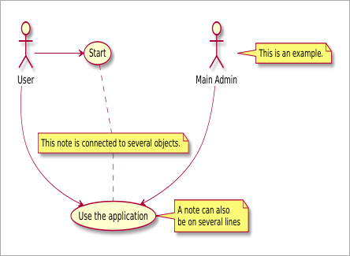

__Class Diagram__

``` coffee
report = new Report()
report.plantuml """
  class Foo1 {
    You can use
    several lines
    ..
    as you want
    and group
    ==
    things together.
    __
    You can have as many groups
    as you want
    --
    End of class
  }

  class User {
    .. Simple Getter ..
    + getName()
    + getAddress()
    .. Some setter ..
    + setName()
    __ private data __
    int age
    -- encrypted --
    String password
  }
  """
```

The markdown is nearly the same but with `$$$ plantuml .... $$$` arround the code.

And in HTML this will look like:


__Activity Diagram (old syntax)__

``` coffee
report = new Report()
report.plantuml """
  (*) --> "Initialization"

  if "Some Test" then
    -->[true] "Some Activity"
    --> "Another activity"
    -right-> (*)
  else
    ->[false] "Something else"
    -->[Ending process] (*)
  endif
  """
```

The markdown is nearly the same but with `$$$ plantuml .... $$$` arround the code.

And in HTML this will look like:


__Activity Diagram (new syntax)__

``` coffee
report = new Report()
report.plantuml """
  :Ready;
  :next(o)|
  :Receiving;
  split
   :nak(i)<
   :ack(o)>
  split again
   :ack(i)<
   :next(o)
   on several line|
   :i := i + 1]
   :ack(o)>
  split again
   :err(i)<
   :nak(o)>
  split again
   :foo/
  split again
   :i > 5}
  stop
  end split
  :finish;
  """
```

The markdown is nearly the same but with `$$$ plantuml .... $$$` arround the code.

And in HTML this will look like:

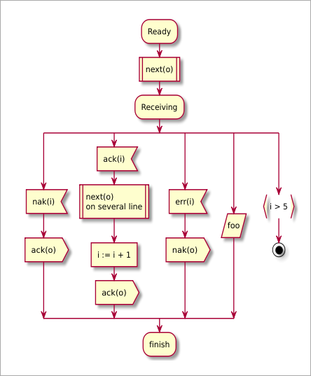

__Component Diagram__

``` coffee
report = new Report()
report.plantuml """
  package "Some Group" {
    HTTP - [First Component]
    [Another Component]
  }

  node "Other Groups" {
    FTP - [Second Component]
    [First Component] --> FTP
  }

  cloud {
    [Example 1]
  }


  database "MySql" {
    folder "This is my folder" {
      [Folder 3]
    }
    frame "Foo" {
      [Frame 4]
    }
  }

  [Another Component] --> [Example 1]
  [Example 1] --> [Folder 3]
  [Folder 3] --> [Frame 4]
  """
```

The markdown is nearly the same but with `$$$ plantuml .... $$$` arround the code.

And in HTML this will look like:


__State Diagram__

``` coffee
report = new Report()
report.plantuml """
  scale 350 width
  [*] --> NotShooting

  state NotShooting {
    [*] --> Idle
    Idle --> Configuring : EvConfig
    Configuring --> Idle : EvConfig
  }

  state Configuring {
    [*] --> NewValueSelection
    NewValueSelection --> NewValuePreview : EvNewValue
    NewValuePreview --> NewValueSelection : EvNewValueRejected
    NewValuePreview --> NewValueSelection : EvNewValueSaved

    state NewValuePreview {
       State1 -> State2
    }

  }
  """
```

The markdown is nearly the same but with `$$$ plantuml .... $$$` arround the code.

And in HTML this will look like:

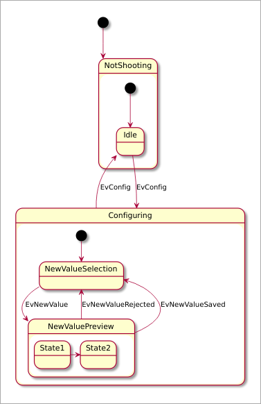

__Deployment Diagram__

``` coffee
report = new Report()
report.plantuml """
  artifact artifact
  actor actor
  folder folder
  node node
  frame frame
  cloud cloud
  database database
  storage storage
  agent agent
  usecase usecase
  component component
  boundary boundary
  control control
  entity entity
  interface interface
  """
```

The markdown is nearly the same but with `$$$ plantuml .... $$$` arround the code.

And in HTML this will look like:

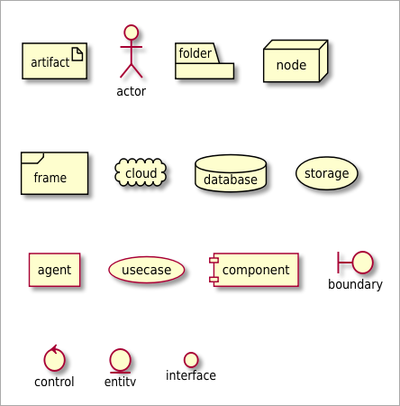

__Object Diagram__

``` coffee
report = new Report()
report.plantuml """
  object user {
    name = "Dummy"
    id = 123
  }
  """
```

The markdown is nearly the same but with `$$$ plantuml .... $$$` arround the code.

And in HTML this will look like:


Wireframe

``` coffee
report.plantuml """
  salt
  {+
  {/ <b>General | Fullscreen | Behavior | Saving }
  {
    { Open image in: | ^Smart Mode^ }
    [X] Smooth images when zoomed
    [X] Confirm image deletion
    [ ] Show hidden images
  }
  [Close]
  }
  """
```

The markdown is nearly the same but with `$$$ plantuml .... $$$` arround the code.

And in HTML this will look like:


Mermaid
--------------------------------------------------------------
A library for creating flowcharts and diagrams out of text.

``` coffee
report = new Report()
report.mermaid """
  graph LR
    A-->B
  """
```

This sumple sequence diagram will be written into execution tags in markdown like:

``` markdown
$$$ mermaid
graph LR
  A-->B
$$$
```

And finally this will render in HTML as:


__Flowchart__

[Flowchart Syntax](http://knsv.github.io/mermaid/#flowcharts-basic-syntax)

``` coffee
report = new Report()
report.mermaid """
  graph LR
    A[Square Rect] -- Link text --> B((Circle))
    A --> C(Round Rect)
    B --> D{Rhombus}
    C --> D
  """
```

The markdown is nearly the same but with `$$$ mermaid .... $$$` arround the code.

And in HTML this will look like:

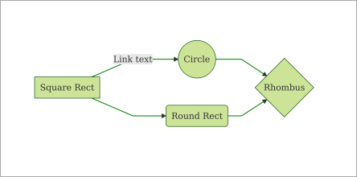

__Sequence Diagram__

[Sequence Syntax](http://knsv.github.io/mermaid/#sequence-diagrams)

``` coffee
report = new Report()
report.mermaid """
  sequenceDiagram
    Alice ->> Bob: Hello Bob, how are you?
    Bob-->>John: How about you John?
    Bob--x Alice: I am good thanks!
    Bob-x John: I am good thanks!
    Note right of John: Bob thinks a long<br/>long time, so long<br/>that the text does<br/>not fit on a row.

    Bob-->Alice: Checking with John...
    Alice->John: Yes... John, how are you?
  """
```

The markdown is nearly the same but with `$$$ mermaid .... $$$` arround the code.

And in HTML this will look like:

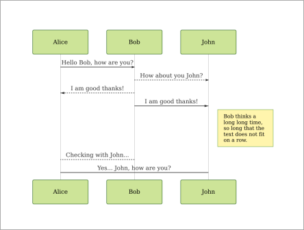

__Gantt Diagram__

[Gantt Syntax](http://knsv.github.io/mermaid/#gant-diagrams)

``` coffee
report = new Report()
report.mermaid """
  gantt
    title A Gantt Diagram

    section Section
    A task           :a1, 2014-01-01, 30d
    Another task     :after a1  , 20d
    section Another
    Task in sec      :2014-01-12  , 12d
    anther task      : 24d
  """
```

The markdown is nearly the same but with `$$$ mermaid .... $$$` arround the code.

And in HTML this will look like:

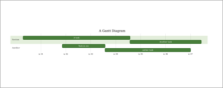
