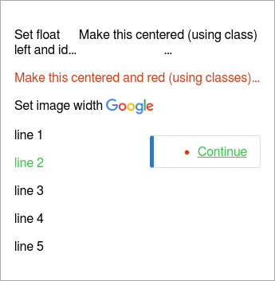

HTML Setup
=======================================================================
This are settings which only influence html output and the formats depending on it
(pdf, images).


Element Style
---------------------------------------------------------------------
You can also give some specific styles (only) for the HTML output. This may overwrite
all default settings:

``` coffee
report = new Report()
report.p "Make this centered (using class)..." + Report.style '.center'
report.p "Make this centered and red (using classes)..." + Report.style '.center.red'
report.p "Set an id and class..." + Report.style '#top .hide'
report.p "Set an specific attriubute" + Report.img('google', 'https://www.google.de/images/branding\
/googlelogo/2x/googlelogo_color_272x92dp.png') + Report.style 'width=20'
```

As seen above it may also be used as instance method, which will add it at the end
or as class method to insert also inline.

Annotations will apply itself to the deepest element preceding it. But you may
To make it apply to a different element, precede your annotations with the tag name
followed by a `:`.
To go back to previous parent with the same name, add '^n' after the tag name, where
'n' is how many levels deep to go back to.

The following classes may be used:

|  STYLE  | RESULT         |
|:-------:|:-------------- |
| .text-red | color: red |
| .text-green | color: green |
| .text-yellow | color: yellow |
| .text-blue | color: blue |
| .text-magenta | color: magenta |
| .text-cyan | color: cyan |
| .text-gray | color: gray |
| .bg-white | background-color: white |
| .center | text-align: center |
| .left | float: left |
| .right | float: right |
| .hide | display: none |
| .spacing | padding: 10px |

In the markdown it is notated within an html comment:

``` markdown
Set float\
left and id...
<!-- {#left .left} -->

Make this centered (using class)...
<!-- {.center} -->

Make this centered and red (using classes)...
<!-- {.center.text-red} -->

Set image width

<!-- {width=60} -->

> * [Continue](#continue)
<!-- {a:.text-green} -->
<!-- {li:.text-red} -->
<!-- {blockquote:.right} -->

line 1

line 2

line 3

line 4

line 5
<!-- {p^3:.text-green} -->
```

And rendered as HTML:



Best preactice is to put this comments in an extra line which will also remove them
from being displayed in github markdown.


Direct Style
------------------------------------------------------------------
As a shortcut to the above possibility you may use your styles in curly braces
directly behind an markdown element to style that element. This also allows to
style some elements like the execute plugin which is not stylable with the above:

``` markdown
$$$ plantuml {.right}
...
$$$

The **bold and red**{.red} text comes here.
```

You can also set attribtes using `{width=100%}` and you can add multiple rules with
`SPACE` as separator.

> With the last argument to the API methods you also can add the styles or other
> attributes. Like used in a box title...


Style Sheets
------------------------------------------------------------------
This will add or overwrite the page style rules. You may also add other rules which
you later call using the above direct style calls:

``` coffee
report = new Report()
report.css "#box {padding: 3px; border: solid black 1px; background: #eee;}
strong {color: red;}"
report.p "This document uses **style sheets** to make look bold text be red and
let some look like **buttons** using direct style for setting."
report.style '#box'
```

You can put everything into the css rules which goes into cascading style sheets.

In the markdown this goes into an execution tag:

``` markdown
$$$ css
#box {padding: 3px; border: solid black 1px; background: #eee;} strong {color: red;}
$$$

This document uses **style sheets** to make look bold text be red and let some
look like **buttons** using direct style for setting.
<!-- {#box} -->
```

The example above will lokk like (rendered as HTML):


Javascript
------------------------------------------------------------------------
Like styles you may also add javascript functions to the document.

``` coffee
report = new Report()
report.js "test = function() { alert('Hello World!')}"
report.p "Call the [demo](#) which is included into the page."
report.style 'onclick="test()"'
```

If you use jQuery it will be added to your document automatically.

In the markdown this goes into an execution tag:

``` markdown
$$$ js
test = function() { alert('Hello World!')}
$$$

Call the [demo](#) which is included into the page.
<!-- {onclick="test()"} -->
```

The example above will lokk like (click to get working HTML):

[](http://htmlpreview.github.io/?https://github.com/alinex/node-report/blob/master/src/examples/js.html)


Header
---------------------------------------------------------------------
You may also add any tag to the HTML head section using:

``` coffee
report = new Report()
report.header '<script type="text/javascript" src="http://myserver.com/my-lib.js"></script>'
```

This will add the script tag to the head section of the resulting HTML.
