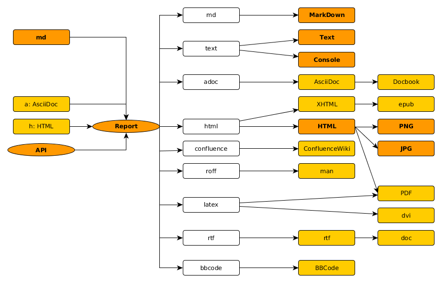

Elements
=====================================================

The following elements are possible:
- {@link heading.md}

Input Data
------------------------------------------------------
But not every format can handle all elements. The markdown format is the only one
can also be used to store and reread data without loss of information.

| Element    | API |  MD  | HTML |
|:---------- |:---:|:----:|:----:|
| Text       |     |  X   |      |
| Heading    |  X  |  X   |      |
| Paragraph  |     |  X   |      |
| ThemaBreak |  X  |  X   |      |
| CharStyle  |  X  |  X   |      |
| Text       |     |  X   |      |

^`X` -> supported; `-` -> not possible; `(X)` -> partly supported;
empty -> not currently done^

Output Formats
------------------------------------------------------
See the following graph with the possible formats:

But not every format can handle all elements. The markdown format is the only one
which can be used to store the report without loosing anything.

Each of the formats support different options you may set ba configuration or on call
(see the {@link ../configSchema.coffee}).

| Element    | MD  | Text | HTML | ROFF | LaTeX | RTF |
|:---------- |:---:|:----:|:----:|:----:|:-----:|:---:|
| Text       |  X  |  X   |  X   |  X   |  X    |  X  |
| Heading    |  X  |  X   |  X   |  X   |       |     |
| Paragraph  |  X  |  X   |  X   |  X   |       |     |
| ThemaBreak |  X  |  X   |  X   |  X   |       |     |
| CharStyle  |  X  | (X)  |  X   |  X   |       |     |
| Text       |     |      |      |      |       |     |

^`X` -> supported; `-` -> not possible; `(X)` -> partly supported;
empty -> not currently done^
